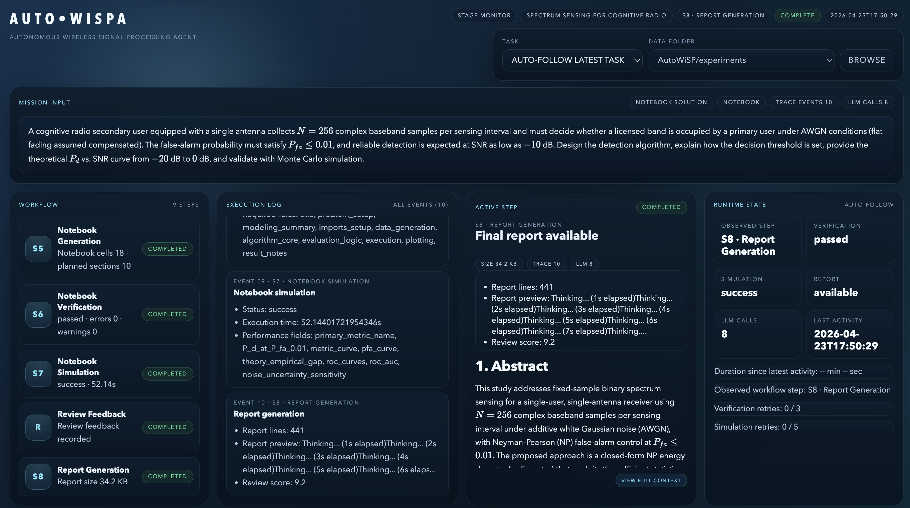
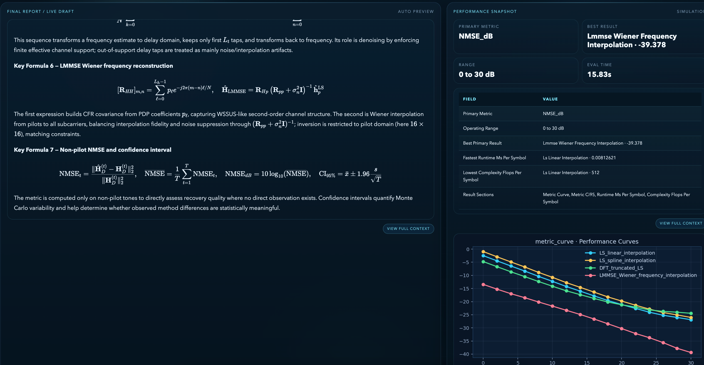

# AutoWiSPA — Automated Wireless Signal Processing Agent

**AutoWiSPA** = **Auto**mated **Wi**reless **S**ignal **P**rocessing **A**gent

[](LICENSE)
[](https://www.python.org/downloads/)
[](https://github.com/langchain-ai/langgraph)

## Overview

Wireless signal processing is at the heart of modern wireless systems such as base stations, radar sensors, and satellite links that provide connectivity and sensing services. The design space is vast and complex, with a rich literature of algorithms and techniques for different deployment scenarios. Yet designing a good algorithm for a new deployment scenario is still a slow, manual process: an engineer reads papers, derives a mathematical model, implements code, runs simulation evaluations, and iterates — often over days or weeks.

**AutoWiSPA Asks: Can an LLM agent do this loop automatically?**

Given a single natural-language description of an SP problem, AutoWiSPA produces:

- A **structured mathematical formulation** with LaTeX equations and variable definitions
- A **runnable Jupyter notebook** with working NumPy/SciPy simulation code
- A **technical report** with performance plots and quantitative results — in the style of a short paper


Existing LLM-for-science frameworks (e.g., AI Scientist) target general research automation. AutoWiSPA can be regarded as a testbed for solving engineering problems in the wireless SP domain. It is a **first-step investigation** into whether LLMs can navigate this space autonomously. We treat it as a positional baseline, a concrete and open starting point for the community to build on. AutoWiSPA has been exercised on representative SP problems, and example artifact folders are included under `experiments/` for inspection. In each case, the system produced a mathematically sound formulation and runnable simulation code that met the stated performance criterion. The results are encouraging, but the harder question is still open.

> **Honest assessment:** AutoWiSPA is suited for **well-studied problems** with clear evaluation metrics and a solid presence in the literature. For highly novel tasks that demand creative algorithmic invention beyond existing knowledge, the system's output should be treated as a structured starting point rather than a final answer. Bridging the gap from *reasonable solution* to *genuinely novel algorithm* remains an exciting open problem.

We open-source this work in the belief that the broader community of researchers, engineers, and industry practitioners is better placed than any single group to advance this direction. **If you have ideas on what it would take to make automated SP algorithm design genuinely useful in practice, we would like to hear from you.**

AutoWiSPA also ships with a read-only artifact monitor for inspecting saved task folders, equations, execution traces, review feedback, and simulation results after or during a run.



---

## Pipeline

AutoWiSPA runs an **8-node** LangGraph `StateGraph` with two self-repair loops, taking a single natural-language query all the way to a simulation-verified report.


**Key properties:**

- **End-to-end** — one sentence in, math formulation + runnable notebook + report out
- **Knowledge-grounded** — retrieves papers (arXiv, Semantic Scholar, CrossRef) and formalizes math before writing any code
- **Self-repairing** — verifier (S6, ≤3 retries) and simulator (S7, ≤5 retries) loop back to notebook generation automatically
- **Open-compatible** — works with GPT-4o, Claude, DeepSeek-V3, or any OpenAI-compatible endpoint
- **Web monitor included** — a Flask-based artifact monitor (`http://127.0.0.1:8080`) for inspecting saved outputs


---

## Quick Start

### 1. Clone & Install

```bash
git clone https://github.com/your-org/AutoWiSPA.git
cd AutoWiSPA

conda create -n LLMPy python=3.11
conda activate LLMPy
pip install -r requirements.txt
```

Minimum install (skips heavy optional deps):

```bash
pip install langgraph langchain-openai openai pydantic python-dotenv pyyaml \
            rich numpy scipy matplotlib ipykernel jupyter_client
```

### 2. Configure API Key

Create or edit `.env` in the project root and fill in one provider section:

```ini
# Optional: force backend selection. If omitted, AutoWiSPA auto-detects
# from the first effective key it finds.
LLM_BACKEND=openai

# Fill in only one provider you actually use.
OPENAI_API_KEY=sk-your-openai-key
# ANTHROPIC_API_KEY=sk-ant-your-anthropic-key
# DEEPSEEK_API_KEY=your-deepseek-key
# POE_API_KEY=your-poe-key
# POE_BOT=GPT-4o
```

Notes:

- AutoWiSPA automatically loads `.env` from the project root.
- If no valid API key is found, the system falls back to the mock backend for offline testing.
- Model names are configured in `config.yaml`, not in `.env`.

### 3. Python API

```python
from main import AutoWiSPA

app = AutoWiSPA()
result = app.run(
    "Design a LS channel estimator for a 64-subcarrier OFDM system."
)

print(result.report_path)          # experiments/<run_id>/report.md
print(result.notebook_path)        # experiments/<run_id>/simulation.ipynb
print(result.output_dir)           # experiments/<run_id>/
print(result.final_score)          # 0.0 – 1.0
print(result.iterations)           # number of repair iterations attempted
print(result.termination_reason)   # "simulation_success" | "max_retries_exceeded" | ...
```

### 4. CLI

```bash
# Single query
python main.py --query "Design a LS channel estimator for a 64-subcarrier OFDM system"

# Built-in demo
python main.py --demo

# Custom output directory
python main.py --demo --output-dir ./my_results
```

### 5. Web Monitor

```bash
python visualization/app.py --port 8080
```

The visualization monitor shows saved stage artifacts, execution traces, notebook outputs, and report content in a browser.

### 6. Monitor Options

```bash
python visualization/app.py --port 8080
```

Custom experiments root or port:

```bash
python visualization/app.py --experiments-root ./experiments --port 8091
```

The visualization monitor is read-only and is useful when you want to inspect saved artifacts rather than launch a new run.

Typical usage:

1. Open `http://127.0.0.1:8080` after the server starts.
2. Let the page auto-follow the latest artifact folder, or choose a task/run from the selector in the header.
3. Use `View Full Context` to inspect raw report text, stage artifacts, and LLM prompt/response payloads.
4. Add `?run=<folder_name>` to the URL if you want to pin the page to a specific task/run folder.

---

## Project Structure

```
AutoWiSPA/
├── main.py                      # AutoWiSPA class + CLI entry point
├── config.yaml                  # Global configuration (models, timeouts, retries)
├── requirements.txt
├── .env                         # API keys — keep out of version control
├── AGENTS.md                    # Developer / AI-agent coding guidelines
├── readme.md
├── docs/                        # Images and supplementary documentation assets
│
├── agents/                      # One file per pipeline stage
│   ├── problem_analyzer.py      # S1: NL query → task_spec
│   ├── knowledge_retriever.py   # S2: Paper/algorithm retrieval
│   ├── model_formalizer.py      # S3: Math formalization (JSON + LaTeX)
│   ├── solution_designer.py     # S4: Notebook plan + evaluation strategy
│   ├── notebook_generator.py    # S5: Notebook generation & repair
│   ├── verifier.py              # S6: Static notebook checks (no LLM call)
│   ├── simulator.py             # S7: Subprocess-sandboxed notebook execution
│   └── reporter.py              # S8: Markdown report synthesis
│
├── graph/
│   ├── state.py                 # AutoWiSPAState TypedDict (pipeline state)
│   ├── nodes.py                 # 8 node functions + checkpoint helpers
│   ├── edges.py                 # Conditional routing (S6 and S7 repair loops)
│   └── builder.py               # build_autowisp_graph() → CompiledGraph
│
├── simulation/
│   ├── sandbox.py               # SubprocessSandbox — isolated notebook execution
│   ├── engine.py                # Execution coordinator
│   └── __init__.py
│
├── knowledge_base/
│   └── ...                      # Curated algorithms, papers, and benchmarks
│
├── templates/                   # Code generation scaffolds (by task category)
│
├── utils/
│   ├── llm_client.py            # Unified LLM client (retry, fallback, logging)
│   ├── event_bus.py             # Pub/sub bus for real-time dashboard updates
│   ├── cli_progress.py          # Rich-based CLI progress reporter
│   ├── checkpoint.py            # Per-node JSON checkpoint save/load
│   ├── md_parser.py             # Markdown <-> structured dict parser
│   ├── paper_search.py          # arXiv / Semantic Scholar / CrossRef client
│   └── evolution.py             # Experiment evolution helpers
│
├── visualization/
│   ├── app.py                   # Web monitor entry (Flask)
│   ├── README.md                # Visualization-specific notes
│   ├── static/                  # Frontend JS/CSS
│   └── templates/               # HTML templates
│
├── prompts/                     # Optional YAML prompt overrides
│
├── experiments/                 # Saved task/run artifacts
│   └── <run_id_or_task_name>/
│       ├── report.md
│       ├── simulation.ipynb             # Final notebook (last successful iteration)
│       ├── simulation_results.json
│       ├── verification_results.json
│       ├── checkpoint.json
│       ├── task_spec.json
│       ├── retrieved_knowledge.json
│       ├── problem_formalization.json
│       ├── solution_plan.json
│       ├── notebook_plan.json
│       ├── review_feedback.json
│       ├── execution_trace.json
│       ├── figures/
│       ├── iterations/
│       │   └── iter_NNN/
│       │       ├── simulation.ipynb     # Notebook snapshot per repair attempt
│       │       └── simulation_results.json
│       └── llm_logs/
│           └── llm_calls.jsonl
│
└── tests/
    ├── test_agents.py
    ├── test_graph.py
    ├── test_simulation.py
    ├── test_utils.py
    ├── test_notebook_integration.py
    └── test_knowledge_base.py
```

---

## Configuration Reference

Key fields in `config.yaml`:

```yaml
llm:
  primary_model: "gpt-4o"           # Any OpenAI-compatible model name
  fallback_models: ["gpt-4o-mini"]
  temperature: 0.1
  retry_attempts: 3
  request_timeout_sec: 180
  node_max_tokens:
    notebook_generation: 20000      # Notebooks can be long — keep generous
    report_generation: 20000

agents:
  max_simulation_retries: 5         # S7 -> S5 repair loop limit

simulation:
  sandbox_timeout: 300              # Hard timeout per notebook execution (seconds)
  quick_eval_samples: 500           # Default Monte Carlo sample count

knowledge_base:
  online_search_enabled: true       # Set false to run fully offline

output:
  experiments_dir: "./experiments"
```

---

## Experiment Output

By default, `app.run()` saves to `experiments/<timestamp>/`. The repository may also contain task-named artifact folders under `experiments/` when you want to inspect curated examples with the visualization monitor. The monitor treats any folder containing recognized artifacts as a valid run/task folder.

| Path | Contents |
|------|----------|
| `report.md` | Full technical report: equations, tables, figure refs |
| `simulation.ipynb` | Final notebook (last successful iteration) |
| `simulation_results.json` | Final simulation metrics |
| `verification_results.json` | Final static check result |
| `checkpoint.json` | Full pipeline state snapshot for debugging |
| `task_spec.json` / `retrieved_knowledge.json` / `problem_formalization.json` | Structured outputs from S1–S3 |
| `solution_plan.json` / `notebook_plan.json` / `review_feedback.json` | Planning, notebook contract, and review artifacts |
| `execution_trace.json` | Step-level execution trace used by the monitor |
| `figures/` | Plots auto-exported from notebook execution |
| `iterations/iter_NNN/simulation.ipynb` | Notebook snapshot per repair attempt |
| `iterations/iter_NNN/simulation_results.json` | Sandbox execution result per attempt |
| `llm_logs/llm_calls.jsonl` | Full LLM call log: role, content, model, token counts |

---

## Technology Stack

| Layer | Choice |
|-------|--------|
| LLM backbone | GPT-4o / Claude 3.5 / DeepSeek-V3 (OpenAI-compatible) |
| Agent framework | LangGraph `StateGraph` |
| Simulation sandbox | Python `subprocess` + `tempfile` |
| Numerical backend | NumPy / SciPy / Matplotlib (in-notebook) |
| Knowledge retrieval | arXiv API, Semantic Scholar, CrossRef |
| Web UI | Gradio Blocks + Flask visualization monitor |
| Testing | pytest |

---

## Running Tests

```bash
# Full suite
pytest -q

# Single module
pytest tests/test_agents.py -q

# Import health check
python -c "
from agents import *
from graph.builder import build_autowisp_graph
g = build_autowisp_graph()
print(f'OK — {len(g.nodes) - 1} pipeline nodes')
"
```

---

## Contributing

Contributions are welcome. Please:

1. Fork the repo and create a feature branch (`git checkout -b feat/your-feature`)
2. Follow the coding conventions in [AGENTS.md](AGENTS.md)
3. Add or update tests for any changed agent or graph logic
4. Run `pytest -q` — all pre-existing tests must pass
5. Open a Pull Request with a clear description of the change

For larger changes (new pipeline stages, new task categories), please open an issue first to discuss the design.

---

## License

MIT License — see [LICENSE](LICENSE).

Copyright © 2026 WQPu
