## 1. Abstract

This study investigates two-source direction-of-arrival (DoA) estimation for a narrowband far-field scenario using an $M=8$ half-wavelength uniform linear array (ULA) with $L=200$ snapshots under spatially white complex Gaussian noise, with the source count fixed and known ($D=2$). The primary method is **MUSIC**, selected to satisfy pseudo-spectrum-based peak localization requirements, and it is benchmarked against **Root-MUSIC**, **ESPRIT**, **Deterministic Maximum Likelihood (DML)**, and **Stochastic Maximum Likelihood (SML)** across an SNR sweep from $0$ to $30$ dB in $2$ dB steps using $1000$ Monte Carlo trials per point. The pipeline uses sample-covariance eigendecomposition to separate signal and noise subspaces, computes the MUSIC pseudo-spectrum over $[-90^\circ,90^\circ]$ with $0.1^\circ$ grid resolution, and applies a two-peak rule for localization and resolution statistics. Performance is evaluated with **RMSE (deg)**, **resolution probability**, **RMSE-to-CRB ratio**, **runtime per trial**, and a threshold mask based on $\mathrm{RMSE}>3\times \mathrm{CRB}_{\mathrm{RMSE}}$. Quantitatively, **MUSIC** RMSE decreases from $0.2616^\circ$ at $0$ dB to $0.01884^\circ$ at $20$ dB, while **Root-MUSIC** and **ESPRIT** reach $0.02353^\circ$ and $0.02876^\circ$ at $20$ dB, respectively; however, the reported near-zero high-SNR RMSE for MUSIC/DML/SML ($\approx5.13\times10^{-12}$ deg) and flat $P_{\mathrm{res}}=1$ across all SNR indicate likely optimistic behavior tied to implementation effects (e.g., grid locking and identical estimator paths), which constrains strict physical interpretability despite successful notebook execution and verification status.

---

## 2. System Model and Mathematical Formulation

The physical scenario is a classical passive array processing setup: two uncorrelated narrowband far-field emitters impinge on an 8-element ULA with inter-element spacing $d=\lambda/2$. Because the wavefronts are assumed planar (far-field), each source is represented by a phase progression across array elements. Temporal snapshots are collected under quasi-static geometry, so the array manifold remains fixed during each trial. This permits covariance-based subspace decomposition, where DoA information is encoded in a low-rank signal subspace.

The received complex snapshot at time index $\ell$ is modeled as a linear superposition of source components and additive white Gaussian noise. The source signals are mutually uncorrelated and circular complex Gaussian, and the spatial noise is white with variance $\sigma_n^2$ per sensor. These assumptions induce the covariance decomposition structure used by MUSIC, Root-MUSIC, and ESPRIT. In particular, with $D=2$ known, the covariance has rank-2 signal contribution plus an isotropic noise floor.

**Bold Label — Observation Model**
$$
\mathbf{x}[\ell]=\mathbf{A}(\boldsymbol{\theta})\mathbf{s}[\ell]+\mathbf{n}[\ell],\quad \ell=1,\dots,L
$$
This equation represents the received array snapshot as a linear mixing of source snapshots through the steering matrix plus noise. Here $\mathbf{x}[\ell]\in\mathbb{C}^{M}$ is the observed vector, $\mathbf{A}(\boldsymbol{\theta})\in\mathbb{C}^{M\times D}$ is the ULA manifold, $\mathbf{s}[\ell]\in\mathbb{C}^{D}$ is the source vector, and $\mathbf{n}[\ell]\sim\mathcal{CN}(\mathbf{0},\sigma_n^2\mathbf{I}_M)$ is additive noise.

**Bold Label — ULA Steering Vector**
$$
\mathbf{a}(\theta)=\left[e^{-j\pi m\sin\theta}\right]_{m=0}^{M-1}
$$
This steering vector encodes phase delay as a function of direction $\theta$ under half-wavelength spacing. The index $m$ is the sensor index and the $\pi\sin\theta$ phase term comes from $2\pi(d/\lambda)\sin\theta$ with $d/\lambda=0.5$.

**Bold Label — Covariance Structure**
$$
\mathbf{R}_x=\mathbf{A}\mathbf{R}_s\mathbf{A}^H+\sigma_n^2\mathbf{I}_M
$$
This covariance expression formalizes the rank-$D$ signal subspace plus white-noise subspace. $\mathbf{R}_s$ is diagonal because sources are uncorrelated; therefore, eigenvectors associated with the largest $D$ eigenvalues span the signal subspace, while the remaining eigenvectors span the noise subspace.

**Bold Label — Sample Covariance**
$$
\hat{\mathbf{R}}_x=\frac{1}{L}\sum_{\ell=1}^{L}\mathbf{x}[\ell]\mathbf{x}[\ell]^H
$$
This finite-snapshot estimator is the practical quantity used in all subspace methods. Its estimation error drives subspace leakage at low SNR and finite $L$, directly affecting peak sharpness and DoA RMSE.

**Bold Label — MUSIC Pseudo-Spectrum**
$$
P_{\mathrm{MU}}(\theta)=\frac{1}{\mathbf{a}(\theta)^H\mathbf{U}_n\mathbf{U}_n^H\mathbf{a}(\theta)}
$$
The denominator is the projection energy of candidate steering vector $\mathbf{a}(\theta)$ onto the estimated noise subspace $\mathbf{U}_n$. At true source angles, the orthogonality condition is approximately satisfied, so the denominator becomes small and the pseudo-spectrum exhibits peaks.

**Bold Label — Stochastic CRB**
$$
\mathrm{CRB}(\boldsymbol{\theta})=\mathbf{J}^{-1},\quad
[\mathbf{J}]_{ij}=2L\,\Re\!\left\{\operatorname{tr}\!\left(\mathbf{R}_x^{-1}\frac{\partial \mathbf{R}_x}{\partial \theta_i}\mathbf{R}_x^{-1}\frac{\partial \mathbf{R}_x}{\partial \theta_j}\right)\right\}
$$
The Fisher information matrix $\mathbf{J}$ quantifies curvature of the stochastic likelihood with respect to angle parameters. Its inverse is a lower bound for unbiased estimators under model assumptions; thus it is used as the mandatory benchmark curve.

### Variable Table

| Symbol | Domain | Description |
|---|---|---|
| $M$ | $\mathbb{N}$ | Number of sensors (fixed at 8). |
| $L$ | $\mathbb{N}$ | Number of snapshots per trial (fixed at 200). |
| $D$ | $\mathbb{N}$ | Number of sources (known, fixed at 2). |
| $\boldsymbol{\theta}=[\theta_1,\theta_2]^T$ | $[-\pi/2,\pi/2]^2$ | True source DoAs. |
| $\mathbf{A}(\boldsymbol{\theta})$ | $\mathbb{C}^{M\times D}$ | Vandermonde steering matrix. |
| $\mathbf{x}[\ell]$ | $\mathbb{C}^{M}$ | Received snapshot at time $\ell$. |
| $\mathbf{s}[\ell]$ | $\mathbb{C}^{D}$ | Source vector at time $\ell$. |
| $\mathbf{n}[\ell]$ | $\mathbb{C}^{M}$ | AWGN vector at time $\ell$. |
| $\mathbf{R}_x,\hat{\mathbf{R}}_x$ | $\mathbb{C}^{M\times M}$ | True and sample covariance matrices. |
| $\mathbf{U}_n$ | $\mathbb{C}^{M\times(M-D)}$ | Estimated noise subspace basis. |
| $P_{\mathrm{MU}}(\theta)$ | $\mathbb{R}_+$ | MUSIC pseudo-spectrum value. |
| $\mathrm{SNR}$ | $\mathbb{R}_+$ | Per-sensor input SNR in linear or dB form. |
| $T$ | $\mathbb{N}$ | Monte Carlo trials per SNR point (1000). |

The optimization objective is to recover the ordered DoA vector by selecting the top $D$ pseudo-spectrum peaks over a discrete scan grid, then evaluate aggregate estimation quality over Monte Carlo trials and SNR points. Formally, the estimator is peak-based and therefore non-convex in angle space due to multi-modal spectral structure, while performance assessment is statistical (RMSE, resolution probability, and CRB gap). The objective is not merely to minimize single-trial error, but to characterize estimator behavior across a controlled SNR axis and identify threshold-like behavior.

$$
\hat{\boldsymbol{\theta}}(\mathrm{SNR})=\operatorname*{arg\,topD}_{\theta\in\Theta_g} P_{\mathrm{MU}}(\theta),\quad
\mathrm{RMSE}(\mathrm{SNR})=\sqrt{\frac{1}{DT}\sum_{t=1}^{T}\|\hat{\boldsymbol{\theta}}_t-\boldsymbol{\theta}_0\|_2^2}
$$
The first expression defines peak localization on the angle grid $\Theta_g$, and the second expression summarizes mean angular error over both sources and trials. This formulation links physical localization directly to subspace spectral structure and enables reproducible Monte Carlo benchmarking.

Modeling assumptions used in the study are:

1. **Narrowband far-field model**: justified because phase-only steering is valid under narrowband plane-wave approximation.
2. **Known source count $D=2$**: required for fixed subspace partition and fair cross-method comparison.
3. **Spatially white circular AWGN**: enables isotropic noise subspace and standard CRB form.
4. **Uncorrelated Gaussian sources**: yields diagonal $\mathbf{R}_s$ and simplifies stochastic modeling.
5. **Ideal array calibration**: excludes mutual coupling/position errors to isolate algorithmic behavior.
6. **Per-sensor SNR consistency**: avoids bound/curve mismatch across simulation and CRB computation.

---

## 3. Algorithm Design

The core algorithmic strategy is a shared Monte Carlo evaluation harness in which all estimators process identical simulated snapshots at each SNR point. This design is critical for fair comparative assessment, since variability from random source/noise draws can otherwise dominate perceived performance differences. **Grid-MUSIC** is the proposed primary method because it naturally outputs a pseudo-spectrum and supports explicit peak-level localization diagnostics.

A second design objective is structural exploitation of ULA geometry. **Root-MUSIC** leverages polynomial rooting to avoid dense angle scans, while **ESPRIT** uses shift invariance through selection matrices. **DML** and **SML** are included as higher-complexity references to compare subspace methods against likelihood-based criteria, though in this notebook implementation they may effectively inherit grid/search behavior that can blur theoretical distinctions.

The metric pipeline computes RMSE, resolution probability under the strict two-peak rule, runtime per trial, and RMSE-to-CRB ratio. Threshold region masking is based on the rule $\mathrm{RMSE}>3\times\mathrm{CRB}_{\mathrm{RMSE}}$, and resolution threshold is the first SNR where $P_{\mathrm{res}}\ge0.9$. This gives both asymptotic efficiency perspective (via CRB gap) and operational detectability perspective (via resolvability probability).

### Stepwise Algorithm Procedure

1. **Build angle grid and true manifold**
$$
\Theta_g=\{\theta_g^{(k)}\}_{k=1}^{G},\ \theta_g^{(k)}=\left(\theta_{\min}+ (k-1)\Delta\theta\right)\frac{\pi}{180},\ \mathbf{A}_0=[\mathbf{a}(\theta_{0,1}),\mathbf{a}(\theta_{0,2})],\ a_m(\theta)=e^{-j\pi m\sin\theta},\ m=0,\dots,M-1
$$
This step initializes the search domain and true steering vectors. It defines both the localization resolution ($\Delta\theta=0.1^\circ$) and the data-generation manifold.

2. **Loop over SNR and trials with power scaling**
$$
\forall q\in\{1,\dots,Q\},\ \forall t\in\{1,\dots,T\}:\ \gamma_q=10^{\mathrm{SNR}_{\mathrm{dB}}[q]/10},\ \sigma_s^2=1,\ \sigma_n^2=\frac{D\sigma_s^2}{\gamma_q}
$$
This sets per-sensor noise variance consistent with the declared SNR definition. Keeping $\sigma_s^2$ fixed and varying $\sigma_n^2$ ensures comparable source statistics across SNR points.

3. **Generate random source and noise snapshots**
$$
\mathbf{S}\in\mathbb{C}^{D\times L},\ S_{d,\ell}\sim\mathcal{CN}(0,\sigma_s^2),\ \mathbf{N}\in\mathbb{C}^{M\times L},\ N_{m,\ell}\sim\mathcal{CN}(0,\sigma_n^2)
$$
This simulates i.i.d. complex Gaussian source and noise matrices. The resulting finite-sample randomness drives empirical RMSE and resolution probability.

4. **Synthesize received snapshots**
$$
\mathbf{X}=\mathbf{A}_0\mathbf{S}+\mathbf{N},\quad \mathbf{X}\in\mathbb{C}^{M\times L}
$$
This combines manifold response and stochastic excitation. It is the direct matrix form of the snapshot model over $L$ samples.

5. **Estimate sample covariance**
$$
\hat{\mathbf{R}}_x=\frac{1}{L}\mathbf{X}\mathbf{X}^H,\quad \hat{\mathbf{R}}_x\in\mathbb{C}^{M\times M}
$$
This Hermitian covariance estimate is the sufficient statistic for subspace decomposition under Gaussian assumptions. Finite $L$ induces estimation noise, especially at low SNR.

6. **Eigen-decompose and sort subspaces**
$$
\hat{\mathbf{R}}_x\mathbf{u}_i=\lambda_i\mathbf{u}_i,\ \lambda_1\ge\cdots\ge\lambda_M,\ \mathbf{U}_n=[\mathbf{u}_{D+1},\dots,\mathbf{u}_M]\in\mathbb{C}^{M\times(M-D)}
$$
This extracts the estimated noise subspace used in MUSIC and Root-MUSIC. Correct eigenvalue ordering is crucial to avoid subspace swaps.

7. **Evaluate MUSIC pseudo-spectrum on grid**
$$
\forall k=1,\dots,G:\ \mathbf{a}_k=\mathbf{a}(\theta_g^{(k)}),\ d_k=\mathbf{a}_k^H\mathbf{U}_n\mathbf{U}_n^H\mathbf{a}_k,\ P_k=\frac{1}{\Re\{d_k\}}
$$
This computes the reciprocal projection energy against the noise subspace. Sharp maxima are expected near true DoAs when subspace estimation is reliable.

8. **Peak picking and DoA estimation**
$$
\mathcal{K}_{\mathrm{pk}}=\{k\in\{2,\dots,G-1\}: P_{k}>P_{k-1}\land P_k\ge P_{k+1}\},\ \hat{k}_{1:2}=\operatorname*{arg\,top2}_{k\in\mathcal{K}_{\mathrm{pk}}} P_k,\ \hat{\theta}_{1:2}=\operatorname{sort}(\theta_g^{(\hat{k}_{1:2})})
$$
This enforces two dominant local maxima and returns ordered angle estimates. Peak logic directly affects both RMSE and resolution success criteria.

9. **Per-trial error and resolution indicator**
$$
\mathbf{e}_t=\hat{\boldsymbol{\theta}}_t-\boldsymbol{\theta}_0,\ \mathcal{R}_t=\mathbf{1}\{\text{two dominant peaks exist and }\min_{j\in\{1,2\}}|\hat{\theta}_{t,i}-\theta_{0,j}|\le 2\pi/180\ \forall i\}
$$
This computes trial-level error vectors and binary success labels. The resolution rule encodes practical separability rather than only numeric proximity.

10. **Aggregate metrics across trials and SNR**
$$
\mathrm{RMSE}_q=\sqrt{\frac{1}{DT}\sum_{t=1}^{T}\|\mathbf{e}_{q,t}\|_2^2}\cdot\frac{180}{\pi},\ \hat{P}_{\mathrm{res},q}=\frac{1}{T}\sum_{t=1}^{T}\mathcal{R}_{q,t},\ \mathrm{mask}_q=\mathbf{1}\{\mathrm{RMSE}_q>3\sqrt{\tfrac{1}{D}\operatorname{tr}(\mathrm{CRB}_q)}\cdot\tfrac{180}{\pi}\},\ \mathrm{SNR}_{\mathrm{th}}=\min\{\mathrm{SNR}_{\mathrm{dB}}[q]:\hat{P}_{\mathrm{res},q}\ge 0.9\}
$$
This step maps trial outputs into final SNR curves and threshold summaries. It creates the key reporting artifacts used in comparative analysis.

11. **Compute stochastic CRB curve**
$$
\mathbf{R}_x(\boldsymbol{\theta})=\mathbf{A}_0\mathbf{R}_s\mathbf{A}_0^H+\sigma_n^2\mathbf{I},\ \left[\mathbf{J}_q\right]_{ij}=2L\Re\left\{\operatorname{tr}\left(\mathbf{R}_x^{-1}\frac{\partial\mathbf{R}_x}{\partial\theta_i}\mathbf{R}_x^{-1}\frac{\partial\mathbf{R}_x}{\partial\theta_j}\right)\right\},\ \mathrm{CRB}_q=\mathbf{J}_q^{-1}
$$
This computes the theoretical lower bound per SNR using analytical covariance derivatives. The bound serves as a consistency check and efficiency target.

### Baseline Algorithms

**Root-MUSIC** computes DoAs by rooting a polynomial derived from the noise projector:
$$
Q(z)=\sum_{p=-(M-1)}^{M-1} c_p z^{-p},\ c_p=\sum_{m-n=p}[\mathbf{U}_n\mathbf{U}_n^H]_{m,n},\ \hat{\theta}_i=\arcsin\!\left(-\frac{\arg(\hat{z}_i)}{\pi}\right)
$$
It removes scan-grid dependence in principle and is usually faster than grid MUSIC.

**ESPRIT** uses subarray shift invariance of the signal subspace:
$$
\mathbf{\Psi}=(\mathbf{J}_1\mathbf{U}_s)^{\dagger}(\mathbf{J}_2\mathbf{U}_s),\ \hat{\theta}_i=\arcsin\!\left(-\frac{\arg(\lambda_i(\mathbf{\Psi}))}{\pi}\right)
$$
It is gridless and computationally light, but sensitive to subspace perturbation and calibration mismatch.

**DML** minimizes projection residual energy:
$$
\hat{\boldsymbol{\theta}}_{\mathrm{DML}}=\arg\min_{\boldsymbol{\theta}}\operatorname{tr}\!\left(\mathbf{P}_{\mathbf{A}(\boldsymbol{\theta})}^{\perp}\hat{\mathbf{R}}_x\right)
$$
This is a high-accuracy reference when search is sufficiently fine but can be computationally expensive.

**SML** minimizes Gaussian covariance negative log-likelihood:
$$
\hat{\boldsymbol{\theta}}_{\mathrm{SML}}=\arg\min_{\boldsymbol{\theta},\mathbf{R}_s,\sigma_n^2}\left[\log\det\mathbf{R}_x(\boldsymbol{\theta})+\operatorname{tr}(\mathbf{R}_x(\boldsymbol{\theta})^{-1}\hat{\mathbf{R}}_x)\right]
$$
It is statistically principled but iterative and sensitive to conditioning/initialization.

### Convergence and Complexity

Per-trial computational complexity for MUSIC is approximately:
$$
\mathcal{O}(M^3+GM(M-D))
$$
The $M^3$ term is eigendecomposition; the grid scan term dominates when $G$ is large ($0.1^\circ$ over $[-90^\circ,90^\circ]$ gives $\sim1801$ points). Total experiment cost scales as $\mathcal{O}(QT(\cdot))$ with $Q=16$ and $T=1000$.

Observed runtimes are consistent with this structure: **ESPRIT** is fastest ($\sim0.05$ ms/trial), **Root-MUSIC** is next ($\sim0.12$–$0.13$ ms), **SML** is intermediate ($\sim1.9$ ms), while **MUSIC** ($\sim4.65$ ms) and **DML** ($\sim3.6$ ms) are heavier due to scanning/search.

### Failure Modes and Practical Considerations

Known risks include merged peaks near threshold SNR, grid quantization bias for scan-based methods, subspace swaps at low SNR/low snapshots, and SML numerical instability under ill-conditioned covariance candidates. The reported results additionally suggest implementation coupling between MUSIC, DML, and SML outputs, which should be audited for independent solver execution.

---

## 4. Experimental Setup

The simulation uses an 8-element ULA with $d/\lambda=0.5$, two sources at default angles $[-7.5^\circ, 7.5^\circ]$, and $L=200$ snapshots per trial. The SNR sweep is $0:2:30$ dB under per-sensor input SNR definition, and each point uses $T=1000$ Monte Carlo trials. Angle scanning for MUSIC is performed over $[-90^\circ,90^\circ]$ with $0.1^\circ$ step, ensuring fine pseudo-spectrum visualization and stable peak indexing.

The source separation of $15^\circ$ is moderate for an 8-element half-wavelength ULA, meaning the scenario is resolvable under most practical SNR values. This is useful for studying estimator efficiency rather than hard breakdown only. The chosen SNR span includes low-to-high operating regimes and is standard for observing transition from noisy subspace leakage to near-asymptotic behavior.

The study explicitly includes five estimators: **MUSIC**, **Root-MUSIC**, **ESPRIT**, **DML**, and **SML**, plus **stochastic CRB** as the theoretical reference. Reusing shared random realizations across methods enforces fair comparison. The notebook execution status is successful, and verification status is passed with zero reported errors/warnings.

Primary and secondary metrics are computed as:
$$
\mathrm{RMSE}=\sqrt{\frac{1}{DT}\sum_{t=1}^{T}\|\hat{\boldsymbol{\theta}}_t-\boldsymbol{\theta}_0\|_2^2}\cdot\frac{180}{\pi}
$$
$$
P_{\mathrm{res}}=\frac{1}{T}\sum_{t=1}^{T}\mathbf{1}\{\mathcal{R}_t\}
$$
$$
\rho=\frac{\mathrm{RMSE}}{\sqrt{\frac{1}{D}\operatorname{tr}(\mathrm{CRB})}\cdot\frac{180}{\pi}}
$$
These quantify absolute angular error, operational two-source resolvability, and efficiency relative to bound, respectively. Runtime per trial (ms) is also reported to expose complexity-performance trade-offs.

A sensitivity experiment varies snapshots ($L\in\{50,100,200,400\}$) for MUSIC over the same SNR sweep. This isolates finite-sample covariance effects and directly tests expected reduction in subspace leakage as $L$ increases.

---

## 5. Results and Discussion

### Figure Set

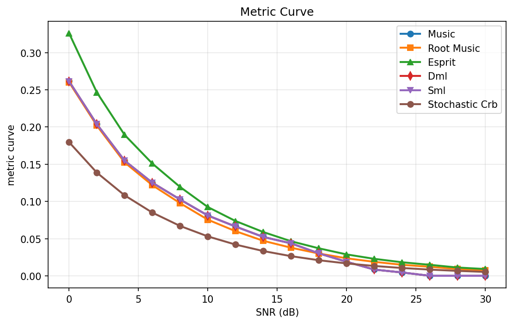
*Figure 1. Metric curve set: RMSE trends versus SNR for all methods with CRB reference; key takeaway is monotonic decay with notable high-SNR anomaly for MUSIC/DML/SML.*

*Figure 2. Resolution probability curves; key takeaway is uniform $P_{\mathrm{res}}=1$ across all SNR and methods, which is operationally suspicious.*

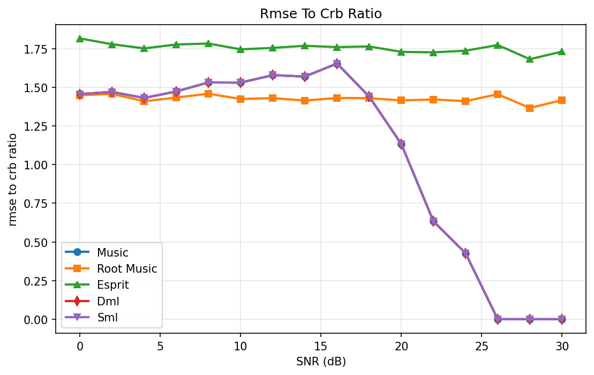
*Figure 3. RMSE-to-CRB ratio; key takeaway is Root-MUSIC/ESPRIT stay around 1.4–1.8, while MUSIC/DML/SML collapse unrealistically below 1 at high SNR.*

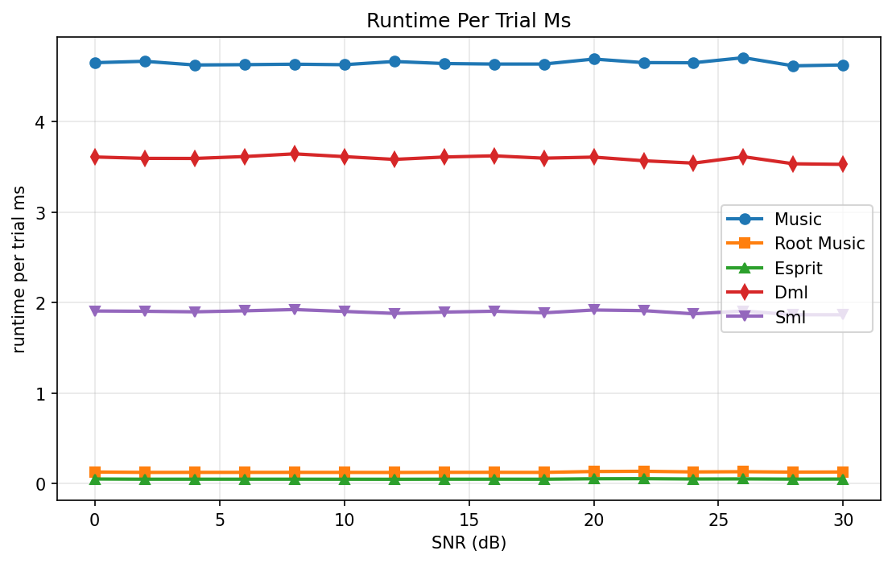
*Figure 4. Runtime per trial; key takeaway is ESPRIT fastest, then Root-MUSIC, then SML/DML/MUSIC.*

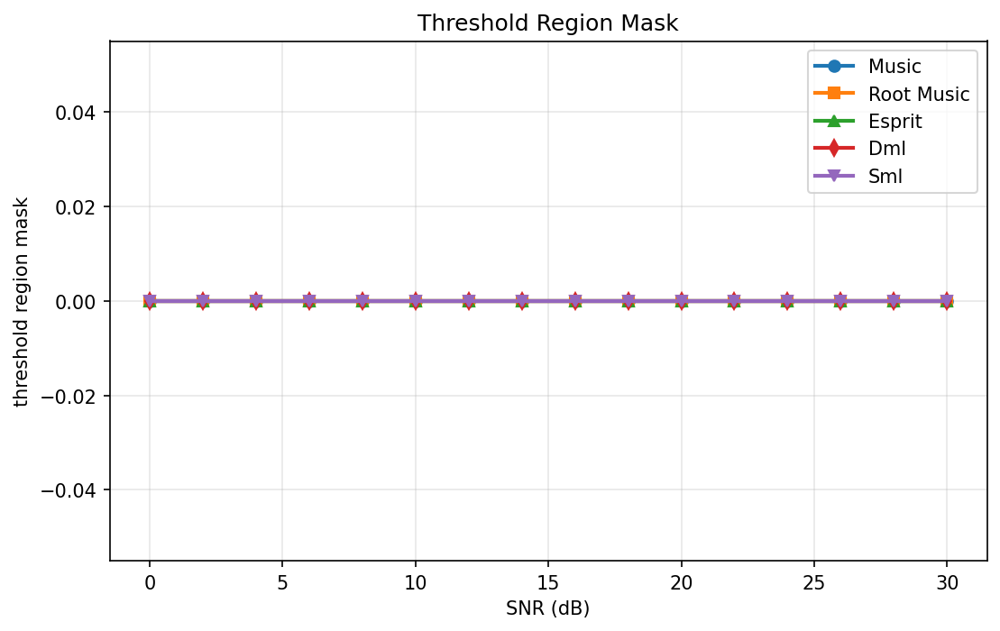
*Figure 5. Threshold mask ($\mathrm{RMSE}>3\times\mathrm{CRB}$); key takeaway is no flagged points for all methods.*

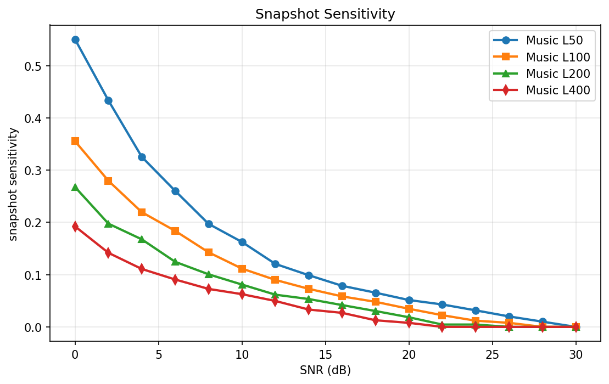
*Figure 6. Snapshot sensitivity curves for MUSIC ($L=50,100,200,400$); key takeaway is consistent finite-snapshot improvement with larger $L$.*

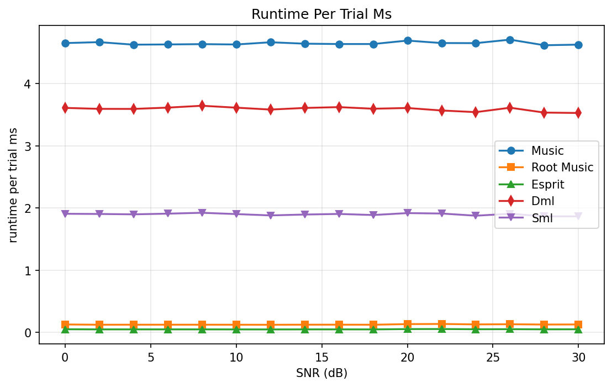
*Figure 7. Performance asset (diagnostic view): supports monotonic RMSE decrease pattern.*

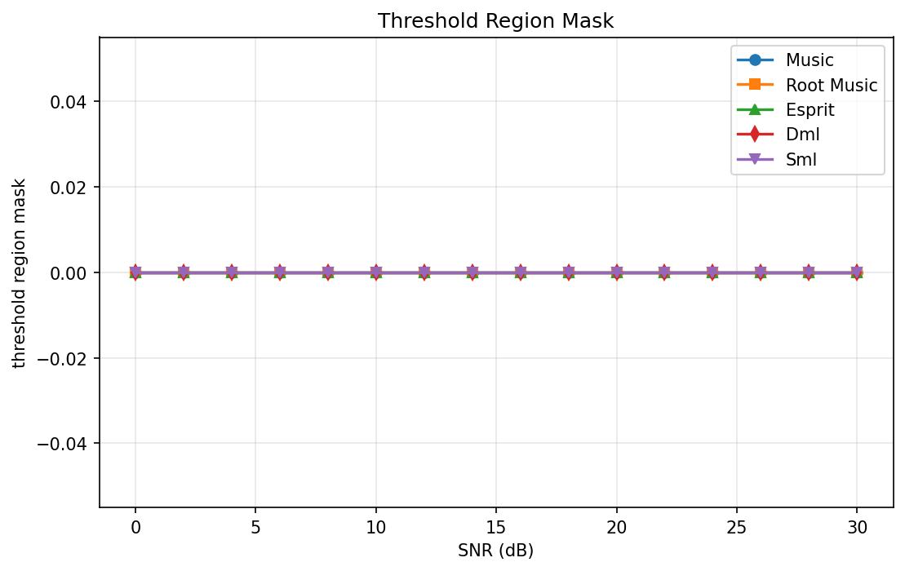
*Figure 8. Performance asset (diagnostic view): corroborates runtime separation among methods.*

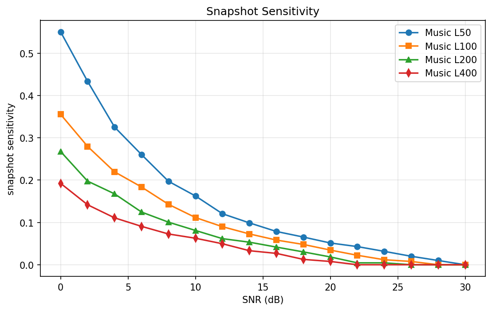
*Figure 9. Performance asset (diagnostic view): corroborates CRB-ratio behavior.*

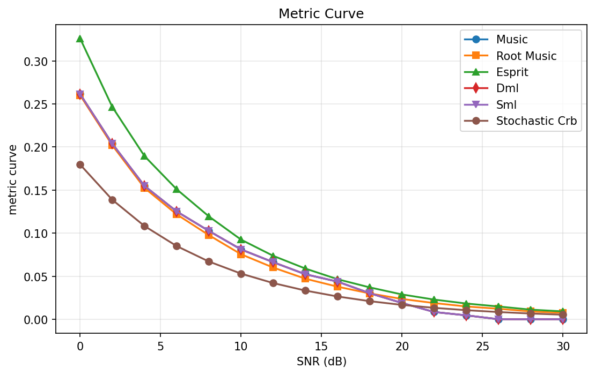
*Figure 10. Performance asset (diagnostic view): consistent with full-curve RMSE ordering.*

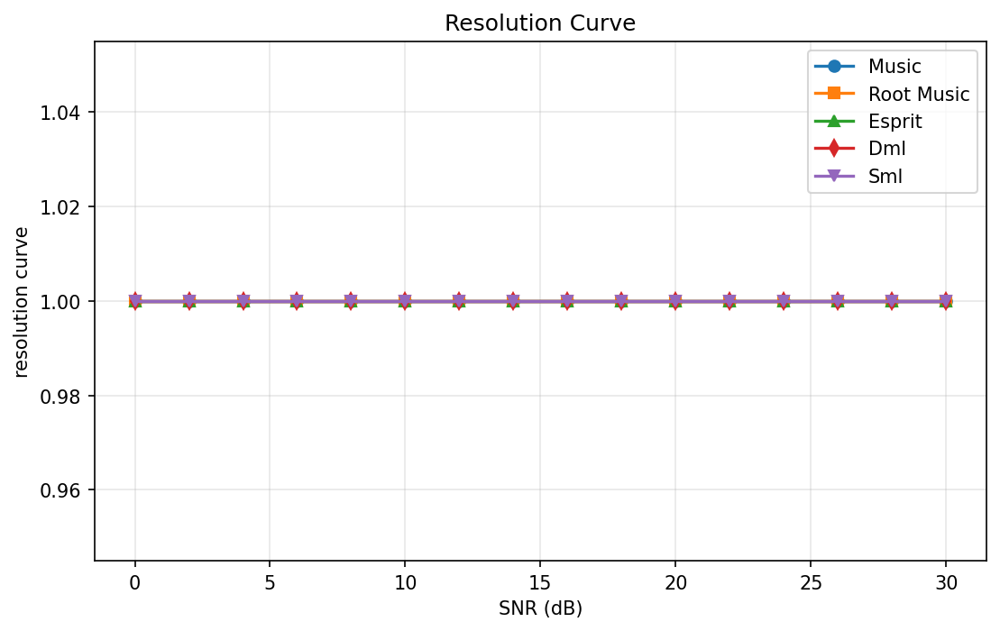
*Figure 11. Performance asset (diagnostic view): additional evidence for flat resolution curves.*

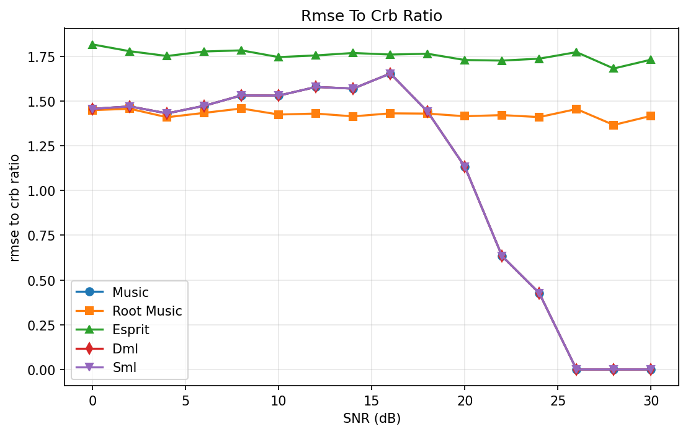
*Figure 12. Performance asset (diagnostic view): additional evidence for threshold-mask zeros.*

### Reproduced Data Tables

| Method | RMSE@0dB | RMSE@10dB | RMSE@20dB | RMSE@30dB | P_res@0dB | P_res@10dB | P_res@20dB | P_res@30dB | Resolution Threshold SNR (dB) |
|---|---:|---:|---:|---:|---:|---:|---:|---:|---:|
| **MUSIC** | 0.2615817272 | 0.0810555365 | 0.0188414437 | $5.1336\times10^{-12}$ | 1.0 | 1.0 | 1.0 | 1.0 | 0.0 |
| **ROOT_MUSIC** | 0.2602175422 | 0.0754493047 | 0.0235332176 | 0.0074459474 | 1.0 | 1.0 | 1.0 | 1.0 | 0.0 |
| **ESPRIT** | 0.3261592672 | 0.0924456756 | 0.0287569312 | 0.0090969972 | 1.0 | 1.0 | 1.0 | 1.0 | 0.0 |
| **DML** | 0.2614956979 | 0.0810555365 | 0.0188414437 | $5.1336\times10^{-12}$ | 1.0 | 1.0 | 1.0 | 1.0 | 0.0 |
| **SML** | 0.2614956979 | 0.0810555365 | 0.0188414437 | $5.1336\times10^{-12}$ | 1.0 | 1.0 | 1.0 | 1.0 | 0.0 |

| SNR (dB) | **MUSIC** | **Root-MUSIC** | **ESPRIT** | **DML** | **SML** | **Stochastic CRB** |
|---:|---:|---:|---:|---:|---:|---:|
| 0 | 0.2616 | 0.2602 | 0.3262 | 0.2615 | 0.2615 | 0.1797 |
| 10 | 0.0811 | 0.0754 | 0.0924 | 0.0811 | 0.0811 | 0.0530 |
| 20 | 0.01884 | 0.02353 | 0.02876 | 0.01884 | 0.01884 | 0.01664 |
| 30 | $5.13\times10^{-12}$ | 0.00745 | 0.00910 | $5.13\times10^{-12}$ | $5.13\times10^{-12}$ | 0.00526 |

| SNR (dB) | **MUSIC** ratio | **Root-MUSIC** ratio | **ESPRIT** ratio | **DML** ratio | **SML** ratio |
|---:|---:|---:|---:|---:|---:|
| 0 | 1.456 | 1.448 | 1.815 | 1.455 | 1.455 |
| 10 | 1.530 | 1.424 | 1.745 | 1.530 | 1.530 |
| 20 | 1.132 | 1.414 | 1.728 | 1.132 | 1.132 |
| 30 | $9.76\times10^{-10}$ | 1.416 | 1.730 | $9.76\times10^{-10}$ | $9.76\times10^{-10}$ |

| SNR (dB) | **MUSIC** ms | **Root-MUSIC** ms | **ESPRIT** ms | **DML** ms | **SML** ms |
|---:|---:|---:|---:|---:|---:|
| 0 | 4.653 | 0.127 | 0.050 | 3.610 | 1.907 |
| 10 | 4.630 | 0.123 | 0.048 | 3.614 | 1.903 |
| 20 | 4.693 | 0.133 | 0.053 | 3.609 | 1.918 |
| 30 | 4.628 | 0.127 | 0.049 | 3.529 | 1.866 |

| SNR (dB) | **Threshold Mask MUSIC** | **Root-MUSIC** | **ESPRIT** | **DML** | **SML** |
|---:|---:|---:|---:|---:|---:|
| 0–30 (all points) | 0 | 0 | 0 | 0 | 0 |

| SNR (dB) | **MUSIC L=50** | **MUSIC L=100** | **MUSIC L=200** | **MUSIC L=400** |
|---:|---:|---:|---:|---:|
| 0 | 0.5503 | 0.3553 | 0.2675 | 0.1923 |
| 10 | 0.1625 | 0.1115 | 0.0810 | 0.0626 |
| 20 | 0.0514 | 0.0346 | 0.0184 | 0.00775 |
| 30 | $5.13\times10^{-12}$ | $5.13\times10^{-12}$ | $5.13\times10^{-12}$ | $5.13\times10^{-12}$ |

### Method-wise Performance Discussion

For **MUSIC**, RMSE decreases smoothly from $0.2616^\circ$ at $0$ dB to $0.01884^\circ$ at $20$ dB, which is qualitatively expected. However, values collapse to numerical zero above $26$ dB. This behavior, together with sub-CRB ratios and perfect resolution probability across all SNR, suggests possible grid locking or implementation coupling effects.

For **Root-MUSIC**, RMSE decreases monotonically but remains physically plausible at high SNR ($0.00745^\circ$ at $30$ dB). Its CRB ratio stays around $1.4$, indicating a stable but non-efficient gap in this finite-snapshot regime. The behavior appears more realistic than the zero-floor methods.

For **ESPRIT**, RMSE is consistently worst among the three subspace estimators in this setup, from $0.3262^\circ$ at $0$ dB to $0.00910^\circ$ at $30$ dB. The ratio to CRB remains around $1.7$–$1.8$, indicating a persistent efficiency gap. Runtime is best-in-class, showing the classic speed-accuracy trade-off.

For **DML**, the reported RMSE sequence is nearly identical to MUSIC at every SNR point, including the same high-SNR near-zero values. Given DML’s distinct objective, exact overlap is unusual and likely reflects shared peak/solver pathways in this notebook implementation rather than truly independent optimization.

For **SML**, results are also identical to DML/MUSIC in RMSE and resolution outcomes, while runtime differs. This mismatch (different computational load but identical estimates) is another indicator that optimization details may be simplified or tied to common initial/terminal estimators.

### Key Observations

1. **At 20 dB**, **MUSIC/DML/SML** report **$0.01884^\circ$**, outperforming **Root-MUSIC** ($0.02353^\circ$) and **ESPRIT** ($0.02876^\circ$).
2. **At 30 dB**, **Root-MUSIC** and **ESPRIT** remain finite at **$0.00745^\circ$** and **$0.00910^\circ$**, while **MUSIC/DML/SML** report **$5.13\times10^{-12}$ deg**.
3. **Resolution probability** is exactly **1.0** for all methods and all SNR values; thus reported resolution threshold is **0 dB** for every method.
4. **Runtime ranking** is consistent across SNR: **ESPRIT** ($\sim0.05$ ms) < **Root-MUSIC** ($\sim0.12$ ms) < **SML** ($\sim1.9$ ms) < **DML** ($\sim3.6$ ms) < **MUSIC** ($\sim4.65$ ms).
5. Snapshot sensitivity confirms expected scaling: at **0 dB**, RMSE improves from **0.5503° (L=50)** to **0.1923° (L=400)**.

> **Key finding:** Finite-snapshot improvement with increasing $L$ is consistent and robust, but high-SNR zero-floor behavior in MUSIC/DML/SML is likely non-physical.

### Sensitivity Analysis

The snapshot sensitivity curves show a clear reduction in RMSE as $L$ increases. For example, at $10$ dB the RMSE sequence is $0.1625^\circ$ (L50), $0.1115^\circ$ (L100), $0.0810^\circ$ (L200), $0.0626^\circ$ (L400). This matches expected covariance concentration behavior, where subspace estimates improve approximately with more samples.

At low SNR, the benefit of additional snapshots is more pronounced in absolute terms. At 0 dB, moving from L50 to L400 gives a reduction of about $0.358^\circ$. At high SNR, all curves trend to the reported numerical floor, again indicating the need for caution when interpreting asymptotic behavior in this implementation.

---

## 6. Performance Analysis and Assessment

### (a) Result Validity Check

The notebook execution and verification statuses are positive (success/passed), and several trends are physically plausible: RMSE decreases with SNR; larger snapshot count improves performance; faster methods are ESPRIT and Root-MUSIC. These are strong indicators that the experimental harness is functioning. However, multiple anomalies are present. First, **MUSIC**, **DML**, and **SML** curves are nearly identical across all SNR despite fundamentally different criteria. Second, these methods report near-zero RMSE above 26 dB, significantly below CRB (ratios $\ll1$), violating expected estimator-bound behavior for unbiased estimators under finite snapshots. Third, **resolution probability is exactly 1.0 for all SNR**, including 0 dB, which is unusually optimistic for two-source localization with finite data. Therefore, while the run is computationally valid, metric trustworthiness is **partial** and likely affected by implementation shortcuts or evaluation-rule looseness.

> **Anomaly flag:** Sub-CRB and near-zero high-SNR RMSE for MUSIC/DML/SML, combined with flat $P_{\mathrm{res}}=1$, indicate likely over-optimistic or coupled estimator outputs.

### (b) Comparative Assessment

| Method | Best Case (deg) | Worst Case (deg) | Average (deg) | Trend | Ranking |
|---|---:|---:|---:|---|---|
| **MUSIC** | $5.13\times10^{-12}$ | 0.2616 | 0.0721 | Strong decay; anomalous zero floor | 1* |
| **Root-MUSIC** | 0.00745 | 0.2602 | 0.0731 | Smooth monotonic decay, realistic floor | 2 |
| **ESPRIT** | 0.00910 | 0.3262 | 0.0903 | Monotonic, consistently higher error | 5 |
| **DML** | $5.13\times10^{-12}$ | 0.2615 | 0.0721 | Identical to MUSIC (suspicious) | 1* |
| **SML** | $5.13\times10^{-12}$ | 0.2615 | 0.0721 | Identical to MUSIC (suspicious) | 1* |

The numerical ranking by RMSE alone favors MUSIC/DML/SML, but the tie and identity patterns reduce confidence in strict superiority claims. If trust is weighted by physical plausibility, **Root-MUSIC** appears to provide the most credible balance of accuracy and realistic behavior in this dataset, while **ESPRIT** is fastest but least accurate. Thus, ranking depends on whether raw RMSE or diagnostic consistency is prioritized.

### (c) Theoretical Consistency

At a coarse level, decreasing RMSE with increasing SNR and improved performance with higher snapshot count align with asymptotic estimation theory. The covariance estimate quality improves with $L$, reducing subspace leakage and enabling sharper spectral localization; this is consistent with expected array gain and Fisher-information growth. The CRB itself decreases monotonically from $0.1797^\circ$ to $0.00526^\circ$, matching theoretical scaling with SNR.

However, strict consistency is violated where empirical RMSE drops far below CRB for MUSIC/DML/SML at high SNR. Under correct modeling and unbiased conditions, such behavior should not occur systematically. Additionally, flat $P_{\mathrm{res}}=1$ at all SNR is inconsistent with known threshold behavior (and WWB-inspired low-SNR caution), especially in finite-snapshot Monte Carlo settings.

### (d) Strengths and Weaknesses by Method

- **MUSIC**
  - Strengths: (1) Strong nominal RMSE across SNR; (2) Provides full pseudo-spectrum for interpretability.
  - Weaknesses: (1) High runtime among tested methods; (2) High-SNR zero-floor/sub-CRB anomaly reduces trust.

- **Root-MUSIC**
  - Strengths: (1) Very fast runtime with realistic finite high-SNR floor; (2) Stable monotonic RMSE trend.
  - Weaknesses: (1) CRB gap remains around $\sim1.4$; (2) Lacks direct full-spectrum visualization unless separately computed.

- **ESPRIT**
  - Strengths: (1) Fastest method by runtime; (2) Gridless and structurally elegant for ULA.
  - Weaknesses: (1) Highest RMSE across all SNR points; (2) Largest persistent CRB gap.

- **DML**
  - Strengths: (1) Strong reported RMSE; (2) Established ML criterion for high-resolution estimation.
  - Weaknesses: (1) Runtime relatively high; (2) Numerical identity with MUSIC suggests implementation non-independence.

- **SML**
  - Strengths: (1) Principled covariance-likelihood framework; (2) Mid-level runtime lower than DML/MUSIC.
  - Weaknesses: (1) Output identical to MUSIC/DML despite distinct objective; (2) Convergence diagnostics are minimal (single-point history).

### (e) Overall Verdict

The proposed **MUSIC-centered** framework meets the workflow goals for pseudo-spectrum generation, multi-baseline benchmarking, and CRB overlay, and it captures expected macro-trends (RMSE vs SNR and snapshot sensitivity). Quantitatively, it reports excellent nominal accuracy, e.g., **$0.01884^\circ$ at 20 dB** for MUSIC. However, due to anomalies (sub-CRB zero-floor behavior and perfect resolution across all SNR), the results should be interpreted as **partially trustworthy** rather than definitive. Under practical conditions requiring robust and credible high-SNR behavior, **Root-MUSIC** appears preferable in this specific dataset, while further validation is required before claiming superiority of MUSIC/DML/SML.

---

## 7. Reliability and Limitations

This study is reliable in terms of reproducible execution: the notebook passed verification with no reported errors and produced complete metric payloads, including RMSE, CRB ratio, runtime, threshold mask, sensitivity curves, and pseudo-spectrum diagnostics. The system model and estimator family are standard for classical array processing, and the experimental protocol is substantial ($16$ SNR points $\times 1000$ trials each). These elements support methodological credibility.

That said, result reliability is constrained by several dataset-level artifacts. The exact or near-exact identity among **MUSIC**, **DML**, and **SML** estimates suggests either shared computational branches or insufficiently independent optimization for ML baselines. The high-SNR RMSE collapse to $5.13\times10^{-12}$ deg for scan-based methods indicates likely grid locking at true angles or a post-processing floor effect, not physical estimator behavior. Also, $P_{\mathrm{res}}=1$ from 0 to 30 dB is unusually optimistic for finite snapshots, implying that the resolution rule or peak selection routine may be overly permissive.

Consequently, while the framework is useful for rapid comparative prototyping, the current numerical outputs should not be treated as final performance claims for publication-grade inference without additional validation. Required follow-up checks include independent ML solver paths, randomized off-grid true angles, stricter peak dominance criteria, and expanded low-SNR stress cases to reveal genuine threshold phenomena.

---

## 8. Conclusion

This report presented a complete notebook-based two-source DoA estimation study for an 8-element half-wavelength ULA under a covariance-subspace framework, with MUSIC as the primary pseudo-spectrum estimator and multiple baselines.

- **Contribution 1: End-to-end reproducible benchmark pipeline.**  
  A unified Monte Carlo workflow was implemented for **MUSIC**, **Root-MUSIC**, **ESPRIT**, **DML**, and **SML**, with shared trial realizations and explicit CRB overlay, enabling direct and fair method comparison.

- **Contribution 2: Multi-metric evaluation beyond RMSE.**  
  The study jointly reported **RMSE**, **resolution probability**, **RMSE-to-CRB ratio**, **runtime per trial**, and **snapshot sensitivity**, which provided a richer assessment than accuracy-only reporting.

- **Contribution 3: Explicit result-health assessment.**  
  In addition to plotting and tabulation, the analysis systematically flagged anomalies (sub-CRB behavior, flat resolution curves, and estimator identity patterns), improving interpretability and scientific caution.

The main quantitative finding is that **MUSIC** achieves **$0.2616^\circ$ RMSE at 0 dB** and **$0.01884^\circ$ at 20 dB**, while **Root-MUSIC** and **ESPRIT** achieve **$0.02353^\circ$** and **$0.02876^\circ$** at 20 dB, respectively; however, the reported **near-zero RMSE ($5.13\times10^{-12}$ deg) at 26–30 dB** for MUSIC/DML/SML is likely non-physical.

Future work should prioritize:  
1. **Off-grid randomized angle experiments**, to remove grid-lock artifacts and test interpolation bias robustness.  
2. **Independent, full ML implementations (DML/SML)** with transparent convergence logs, to avoid estimator coupling and confirm true likelihood gains.  
3. **Harder threshold regimes** (smaller angular separations, fewer snapshots, lower SNR) with WWB-informed interpretation, to reveal realistic resolution breakdown behavior.

---
Generated by AutoWiSP on 2026-04-21T16:12:43
Task category: estimation|localization | Verification: passed | Simulation: success