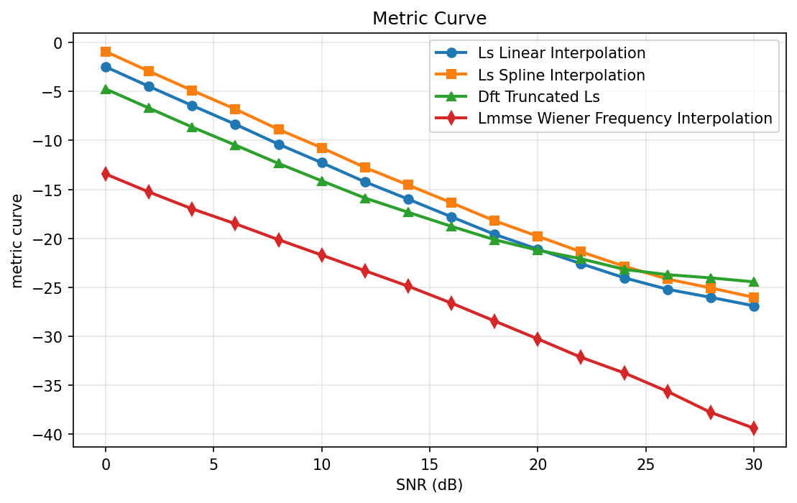
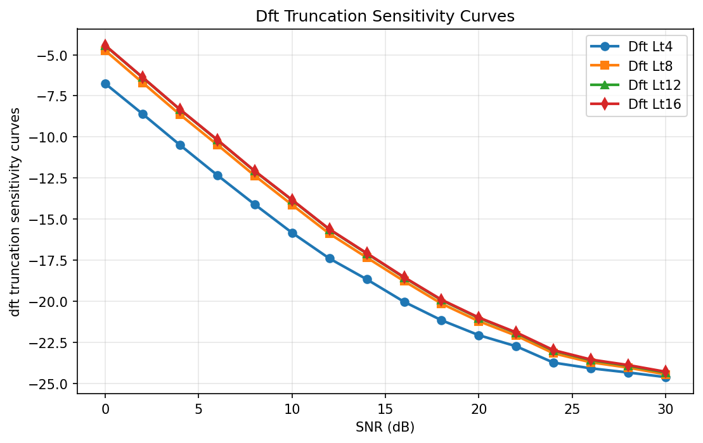
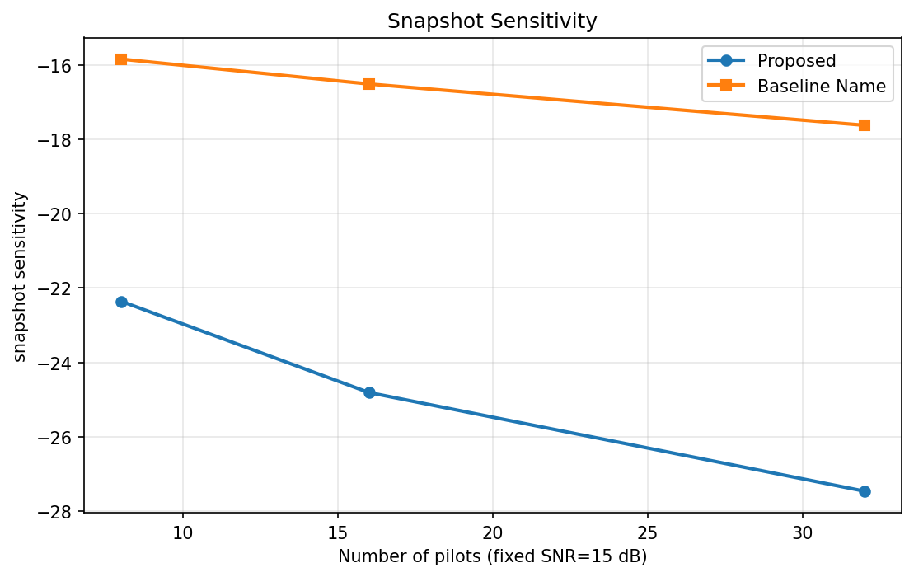
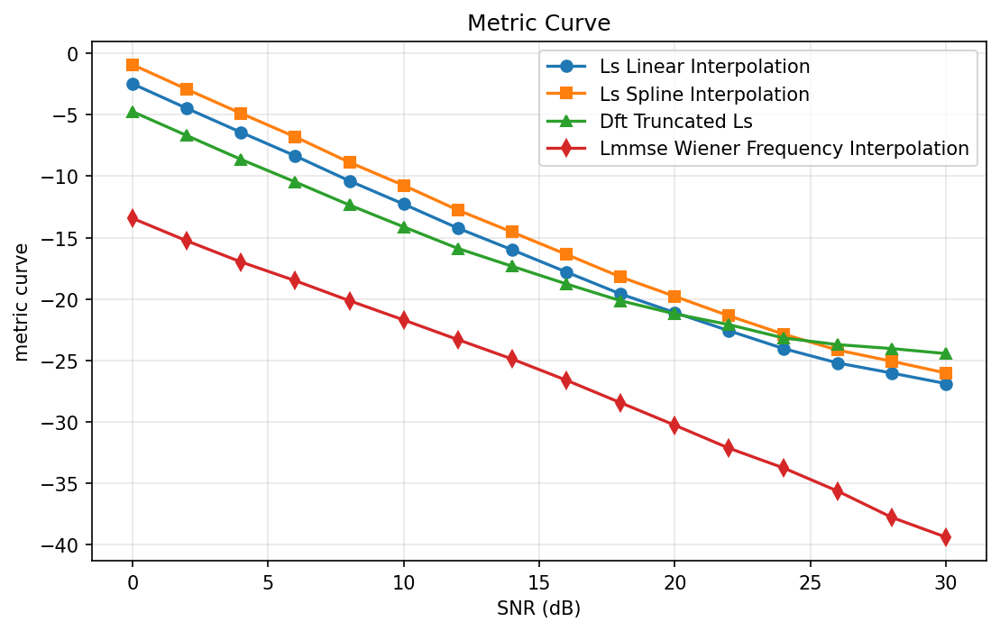
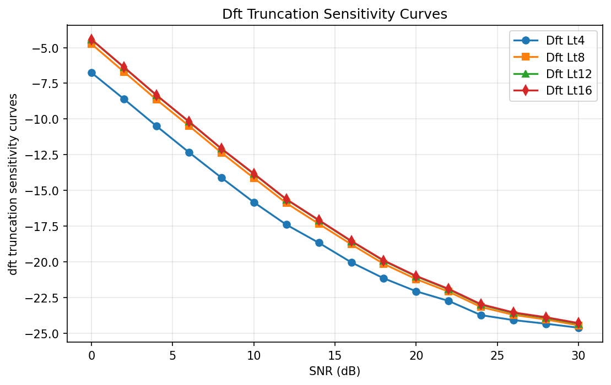
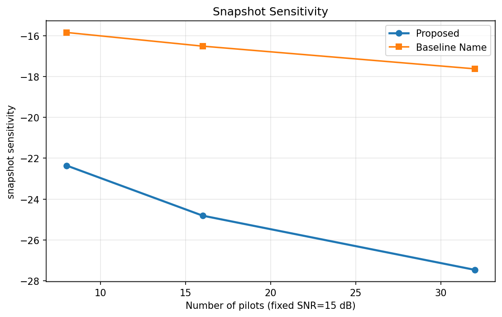

Thinking... (1s elapsed)Thinking... (2s elapsed)Thinking... (3s elapsed)Thinking... (4s elapsed)Thinking... (5s elapsed)Thinking... (6s elapsed)Thinking... (7s elapsed)Thinking... (8s elapsed)Thinking... (9s elapsed)Thinking... (10s elapsed)Thinking... (11s elapsed)Thinking... (12s elapsed)Thinking... (13s elapsed)Thinking... (14s elapsed)Thinking... (15s elapsed)Thinking... (16s elapsed)Thinking... (17s elapsed)Thinking... (18s elapsed)Thinking... (19s elapsed)Thinking... (20s elapsed)Thinking... (21s elapsed)Thinking... (22s elapsed)Thinking... (23s elapsed)Thinking... (24s elapsed)## 1. Abstract

This study addresses full-band channel frequency response (CFR) recovery in a pilot-aided SISO OFDM link with $N=64$ active subcarriers, where only $N_p=16$ uniformly spaced comb pilots (every 4 subcarriers) are directly observed and the remaining 48 non-pilot tones must be estimated under noise. The pilot-domain observation follows $\mathbf{y}_p=\mathbf{X}_p\mathbf{h}_p+\mathbf{n}_p$ with known unit-modulus pilots, and three estimator classes with explicit complexity-performance separation are compared: **LS + linear/spline interpolation** (low complexity baseline), **DFT-truncated LS reconstruction** (moderate complexity, delay-domain denoising), and **pilot-domain covariance-aided LMMSE Wiener interpolation** (higher complexity, second-order optimal linear estimator). The simulation uses synthetic 3GPP TDL-A channels at 3.5 GHz, 0.96 MHz bandwidth ($\Delta f=15$ kHz), CP length 16, RMS delay spread 30 ns, and a 0:2:30 dB SNR sweep with 500 Monte Carlo trials per SNR and 95% confidence intervals. Results show monotonic NMSE improvement with SNR for all methods, but with clear separation: at 30 dB, **LS-linear** reaches $-26.88$ dB, **LS-spline** $-26.02$ dB, **DFT-truncated** $-24.44$ dB (for $L_t=8$), and **LMMSE** $-39.38$ dB. Averaged across the SNR sweep, **LMMSE** achieves $-26.14$ dB versus $-16.12$ dB for **LS-linear**, yielding roughly 10 dB class-level advantage. Runtime/complexity measurements confirm expected trade-offs: **LS-linear** is fastest ($0.0081$ ms/symbol), **DFT-truncated** remains near-baseline ($0.0111$ ms), while **LMMSE** is slowest ($0.3503$ ms) but most accurate. Sensitivity analysis further shows DFT truncation-length dependence and substantial gains from higher pilot density.

---

## 2. System Model and Mathematical Formulation

We consider a single-antenna OFDM downlink/uplink-equivalent baseband model with $N=64$ active subcarriers and comb pilots on indices $\mathcal{P}=\{0,4,8,\dots,60\}$, so $|\mathcal{P}|=16$. The data-bearing non-pilot indices are $\mathcal{D}=\{0,\dots,63\}\setminus\mathcal{P}$ with $|\mathcal{D}|=48$. The propagation follows a frequency-selective 3GPP TDL-A model under low mobility (3 km/h), and per-symbol quasi-static fading is assumed. Because the RMS delay spread (30 ns) is small relative to inverse occupied bandwidth, the CFR is smooth across frequency and strongly correlated between nearby pilot and data tones.

The OFDM numerology is fixed at $\Delta f=15$ kHz, yielding occupied bandwidth $N\Delta f=0.96$ MHz, with CP length $N_{\text{CP}}=16$ samples. Under perfect synchronization and known unit-modulus pilots, the estimation task is decoupled to frequency-domain pilot observations followed by full-band reconstruction. The modeling focus is not equalization/detection, but accurate recovery of $\mathbf{H}\in\mathbb{C}^{64}$, especially over non-pilot tones where interpolation/modeling quality is tested.

**Key Formula 1 — Pilot-domain observation model**
$$
\mathbf{y}_p=\mathbf{X}_p\mathbf{h}_p+\mathbf{n}_p,\quad \mathbf{n}_p\sim\mathcal{CN}(\mathbf{0},\sigma_n^2\mathbf{I})
$$
This equation models the received pilot vector $\mathbf{y}_p\in\mathbb{C}^{16}$ as known pilot symbols $\mathbf{X}_p$ multiplying the true pilot CFR samples $\mathbf{h}_p$, corrupted by circular complex AWGN $\mathbf{n}_p$. Physically, it is the per-subcarrier input-output relation after OFDM demodulation and assuming negligible inter-carrier interference within one symbol.

**Key Formula 2 — LS pilot estimator**
$$
\hat{\mathbf{h}}_p^{\mathrm{LS}}=\mathbf{X}_p^{-1}\mathbf{y}_p=\mathbf{y}_p \quad (\text{unit pilots})
$$
This is the unbiased per-pilot estimator used by all methods as an initial observation. Since pilots are unit-modulus and known, LS reduces to direct division, which minimizes implementation complexity and isolates the reconstruction stage as the main differentiator among methods.

**Key Formula 3 — Linear interpolation reconstruction**
$$
\hat H_{\mathrm{lin}}[k]=\mathcal{I}_{\mathrm{lin}}\{(k_{p,m},\hat H_p^{\mathrm{LS}}[m])\}(k)
$$
Here $\mathcal{I}_{\mathrm{lin}}(\cdot)$ denotes piecewise linear interpolation from pilot positions $k_{p,m}$ to all $k\in\{0,\dots,63\}$. This uses local frequency smoothness and is computationally minimal, but does not explicitly suppress noise or enforce delay-domain structure.

**Key Formula 4 — Spline interpolation reconstruction**
$$
\hat H_{\mathrm{spline}}[k]=\sum_{m=0}^{N_p-1}\hat H_p^{\mathrm{LS}}[m]\,
\beta_3\!\left(\frac{k-k_{p,m}}{\Delta k}\right)
$$
The cubic basis $\beta_3(\cdot)$ induces smoother local curvature than linear interpolation. It can better approximate gently varying CFRs, but may introduce overshoot/edge artifacts and can fit pilot noise if regularization is absent.

**Key Formula 5 — DFT delay-domain truncation**
$$
\tilde h[n]=\frac{1}{N}\sum_{k=0}^{N-1}\hat H_{\mathrm{lin}}[k]e^{j2\pi kn/N},
\quad
\hat h_T[n]=\tilde h[n]\mathbf{1}_{0\le n<L_t},
\quad
\hat H_{\mathrm{DFT}}[k]=\sum_{n=0}^{N-1}\hat h_T[n]e^{-j2\pi kn/N}
$$
This sequence transforms a frequency estimate to delay domain, keeps only first $L_t$ taps, and transforms back to frequency. Its role is denoising by enforcing finite effective channel support; out-of-support delay taps are treated as mainly noise/interpolation artifacts.

**Key Formula 6 — LMMSE Wiener frequency reconstruction**
$$
[\mathbf{R}_{HH}]_{m,n}=\sum_{\ell=0}^{L_h-1}p_\ell e^{-j2\pi(m-n)\ell/N},
\quad
\hat{\mathbf{H}}_{\mathrm{LMMSE}}
=
\mathbf{R}_{Hp}\left(\mathbf{R}_{pp}+\sigma_n^2\mathbf{I}\right)^{-1}
\hat{\mathbf{h}}_p^{\mathrm{LS}}
$$
The first expression builds CFR covariance from PDP coefficients $p_\ell$, capturing WSSUS-like second-order channel structure. The second is Wiener interpolation from pilots to all subcarriers, balancing interpolation fidelity and noise suppression through $(\mathbf{R}_{pp}+\sigma_n^2\mathbf{I})^{-1}$; inversion is restricted to pilot domain (here $16\times16$), matching constraints.

**Key Formula 7 — Non-pilot NMSE and confidence interval**
$$
\mathrm{NMSE}_t=\frac{\|\hat{\mathbf{H}}_D^{(t)}-\mathbf{H}_D^{(t)}\|_2^2}{\|\mathbf{H}_D^{(t)}\|_2^2},
\quad
\overline{\mathrm{NMSE}}=\frac{1}{T}\sum_{t=1}^T\mathrm{NMSE}_t,
\quad
\mathrm{NMSE}_{dB}=10\log_{10}(\overline{\mathrm{NMSE}}),
\quad
\mathrm{CI}_{95\%}=\bar x\pm1.96\frac{s}{\sqrt{T}}
$$
The metric is computed only on non-pilot tones to directly assess recovery quality where no direct observation exists. Confidence intervals quantify Monte Carlo variability and help determine whether observed method differences are statistically meaningful.

### Variable Table

| Symbol | Domain | Description |
|:---|:---|:---|
| $N$ | $\mathbb{Z}_+$ | Number of OFDM subcarriers (64) |
| $N_p$ | $\mathbb{Z}_+$ | Number of pilot subcarriers (16) |
| $N_d$ | $\mathbb{Z}_+$ | Number of non-pilot subcarriers (48) |
| $\mathcal{P}$ | index set | Pilot indices |
| $\mathcal{D}$ | index set | Non-pilot/data indices |
| $\mathbf{y}_p$ | $\mathbb{C}^{N_p}$ | Received pilot observations |
| $\mathbf{X}_p$ | $\mathbb{C}^{N_p\times N_p}$ | Known pilot-symbol diagonal matrix |
| $\mathbf{h}_p$ | $\mathbb{C}^{N_p}$ | True pilot-domain CFR samples |
| $\hat{\mathbf{h}}_p^{\mathrm{LS}}$ | $\mathbb{C}^{N_p}$ | LS estimate at pilot tones |
| $\mathbf{n}_p$ | $\mathbb{C}^{N_p}$ | AWGN vector |
| $\sigma_n^2$ | $\mathbb{R}_+$ | Noise variance per pilot tone |
| $\hat H_{\mathrm{lin}}[k]$ | $\mathbb{C}$ | Linear-interpolated CFR at tone $k$ |
| $\hat H_{\mathrm{spline}}[k]$ | $\mathbb{C}$ | Spline-interpolated CFR at tone $k$ |
| $\tilde h[n]$ | $\mathbb{C}$ | Delay-domain representation via IFFT |
| $\hat h_T[n]$ | $\mathbb{C}$ | Truncated delay-domain estimate |
| $L_t$ | $\mathbb{Z}_+$ | Truncation length hyperparameter |
| $\hat H_{\mathrm{DFT}}[k]$ | $\mathbb{C}$ | DFT-truncated reconstructed CFR |
| $p_\ell$ | $\mathbb{R}_+$ | PDP power of delay tap $\ell$ |
| $\mathbf{R}_{HH}$ | $\mathbb{C}^{N\times N}$ | Full CFR covariance matrix |
| $\mathbf{R}_{Hp}$ | $\mathbb{C}^{N\times N_p}$ | Cross-covariance (all tones vs pilots) |
| $\mathbf{R}_{pp}$ | $\mathbb{C}^{N_p\times N_p}$ | Pilot covariance submatrix |
| $\hat{\mathbf{H}}_{\mathrm{LMMSE}}$ | $\mathbb{C}^{N}$ | LMMSE full-band CFR estimate |
| $T$ | $\mathbb{Z}_+$ | Monte Carlo trials per SNR (500) |
| $\mathrm{NMSE}_t$ | $\mathbb{R}_+$ | Trial-wise normalized MSE on non-pilot set |
| $\overline{\mathrm{NMSE}}$ | $\mathbb{R}_+$ | Monte Carlo mean NMSE |
| $\mathrm{SNR}$ | dB | Signal-to-noise ratio sweep variable |

The optimization objective is to minimize expected non-pilot reconstruction error while respecting implementation constraints on estimator complexity. In statistical terms, each estimator aims to reduce $\mathbb{E}\big[\|\hat{\mathbf{H}}_{\mathcal D}-\mathbf{H}_{\mathcal D}\|_2^2/\|\mathbf{H}_{\mathcal D}\|_2^2\big]$; in practice this expectation is approximated by Monte Carlo averaging over channel and noise realizations. The study also imposes structural constraints: include a no-matrix-inversion interpolation baseline, and restrict any explicit inversion to pilot domain with dimension at most $16\times16$.

Modeling assumptions are as follows:

1. **Block fading within one OFDM symbol**: channel is quasi-static across one symbol, enabling per-symbol frequency-domain estimation.
2. **Perfect synchronization and impairment compensation**: timing/CFO/phase noise are pre-compensated to isolate channel estimation effects.
3. **Known unit-modulus pilots**: pilots are deterministic and power normalized, reducing LS pilot estimation to elementwise division.
4. **All 64 subcarriers active**: no virtual carriers/DC null in this experiment, simplifying indexing and covariance extraction.
5. **WSSUS-approximate TDL-A statistics**: second-order stationarity supports covariance-driven LMMSE design.
6. **RMS delay spread of 30 ns**: motivates frequency smoothness and strong pilot-to-data correlation.
7. **Finite effective delay support under CP**: justifies DFT-domain truncation denoising.
8. **Synthetic-only data generation**: avoids dataset bias but may not include hardware impairments.
9. **500 trials per SNR**: chosen to stabilize mean NMSE and CI estimates.
10. **Pilot-domain inversion bound**: ensures LMMSE remains computationally bounded and compliant with constraints.

---

## 3. Algorithm Design

The estimator suite is intentionally structured as a progression from minimal modeling to stronger prior exploitation. At the lowest complexity, **LS + interpolation** uses only pilot observations and local smoothness assumptions. This provides a practical baseline with minimal computational burden and no matrix inversion, useful for latency-sensitive implementations.

The intermediate strategy, **DFT-truncated LS**, augments interpolation with delay-domain structure. The insight is that a physically plausible multipath channel occupies only a short portion of delay support; therefore, IFFT-domain coefficients beyond $L_t$ are likely dominated by noise or interpolation artifacts. By zeroing those taps and transforming back, the method can improve robustness at low-to-mid SNR while preserving FFT-friendly complexity.

The high-performance strategy, **LMMSE Wiener interpolation**, explicitly uses PDP-derived second-order statistics. This method computes the minimum-MSE linear estimate under assumed covariance and AWGN model. While computationally heavier than interpolation methods, the inversion is only $16\times16$, so it remains tractable and adheres to the stated constraint. The combined design therefore spans a clear complexity-performance frontier.

### Stepwise Algorithm Procedure

1. **Pilot observation generation**
$$
\mathbf{y}_p = \mathbf{X}_p\mathbf{h}_p + \mathbf{n}_p,\quad \mathbf{n}_p\sim\mathcal{CN}(\mathbf{0},\sigma_n^2\mathbf{I})
$$
This computes the noisy pilot samples from true pilot CFR values and known pilots. It is the stochastic input to all estimators and controls difficulty through $\sigma_n^2$ (hence SNR).

2. **Pilot LS estimation**
$$
\hat{\mathbf{h}}_p^{\mathrm{LS}} = \mathbf{X}_p^{-1}\mathbf{y}_p\;\;(=\mathbf{y}_p\text{ for unit pilots})
$$
This extracts unbiased pilot-domain channel estimates. The step is common across methods, enabling fair comparison focused on reconstruction differences rather than pilot extraction differences.

3. **LS linear interpolation**
$$
\hat H_{\mathrm{lin}}[k] = \mathcal{I}_{\mathrm{lin}}\left\{(k_{p,m},\hat H_p^{\mathrm{LS}}[m])\right\}(k),\;k=0,\dots,N-1
$$
This reconstructs all 64 tones from 16 pilot estimates using piecewise linear interpolation. It is computationally light and serves as the lowest-complexity reference.

4. **LS spline interpolation**
$$
\hat H_{\mathrm{spline}}[k] = \sum_{m=0}^{N_p-1} \hat H_p^{\mathrm{LS}}[m]\,\beta_3\!\left(\frac{k-k_{p,m}}{\Delta k}\right)
$$
This produces a smoother curve than linear interpolation by using cubic basis functions. It can better fit gently curved CFR profiles, at the expense of increased runtime and possible edge overshoot.

5. **DFT delay-domain truncation**
$$
\tilde h[n]=\frac{1}{N}\sum_{k=0}^{N-1}\hat H_{\mathrm{lin}}[k]e^{j2\pi kn/N},\;\hat h_T[n]=\tilde h[n]\mathbf{1}_{0\le n<L_t},\;\hat H_{\mathrm{DFT}}[k]=\sum_{n=0}^{N-1}\hat h_T[n]e^{-j2\pi kn/N}
$$
This step denoises by enforcing finite delay support via truncation length $L_t$. It suppresses high-delay leakage that is unlikely under the assumed channel and improves estimation in noise-limited regimes.

6. **LMMSE Wiener interpolation**
$$
[\mathbf{R}_{HH}]_{m,n}=\sum_{\ell=0}^{L_h-1}p_\ell e^{-j2\pi(m-n)\ell/N},\quad \hat{\mathbf{H}}_{\mathrm{LMMSE}}=\mathbf{R}_{Hp}(\mathbf{R}_{pp}+\sigma_n^2\mathbf{I})^{-1}\hat{\mathbf{h}}_p^{\mathrm{LS}}
$$
This computes full-band reconstruction using second-order channel covariance and noise-aware shrinkage. It is theoretically optimal among linear estimators under correct covariance assumptions.

7. **Metric and uncertainty computation**
$$
\mathrm{NMSE}_t=\frac{\|\hat{\mathbf{H}}_D^{(t)}-\mathbf{H}_D^{(t)}\|_2^2}{\|\mathbf{H}_D^{(t)}\|_2^2},\;\overline{\mathrm{NMSE}}=\frac{1}{T}\sum_{t=1}^T\mathrm{NMSE}_t,\;\mathrm{NMSE}_{dB}=10\log_{10}(\overline{\mathrm{NMSE}}),\;\mathrm{CI}_{95\%}=\bar x\pm1.96\frac{s}{\sqrt{T}}
$$
This quantifies reconstruction quality on the 48 non-pilot tones and statistical confidence over trials. Reporting both mean and CI prevents over-interpretation of small method gaps.

### Baseline Algorithms

**Baseline 1: LS + Linear Interpolation**  
This method is the primary low-complexity benchmark and requires only pilot LS plus piecewise interpolation. It has very low runtime ($0.0081$ ms/symbol) and FLOP proxy (512), making it attractive in constrained hardware.  
$$
\hat H_{\mathrm{lin}}[k]=\mathcal{I}_{\mathrm{lin}}\{(k_{p,m},\hat H_p^{\mathrm{LS}}[m])\}(k)
$$

**Baseline 2: LS + Spline Interpolation**  
This baseline increases interpolation order to reduce piecewise linear bias in smooth channels. In this dataset, it is slower than linear interpolation and often underperforms it slightly, suggesting sensitivity to noise/edge behavior.  
$$
\hat H_{\mathrm{spline}}[k]=\sum_m \hat H_p^{\mathrm{LS}}[m]\beta_3\!\left(\frac{k-k_{p,m}}{\Delta k}\right)
$$

**Baseline 3: DFT-truncated LS**  
Although model-aided, this is treated as a moderate-complexity benchmark between interpolation and LMMSE. It uses FFTs plus truncation and is sensitive to selected $L_t$.  
$$
\hat H_{\mathrm{DFT}}=\mathrm{FFT}\left\{\mathrm{IFFT}(\hat H_{\mathrm{lin}})\cdot\mathbf{1}_{[0,L_t-1]}\right\}
$$

**Baseline 4: LMMSE Wiener Interpolation**  
This is the strongest expected estimator under accurate covariance. It is computationally heaviest but still constrained by pilot-domain inversion size.  
$$
\hat{\mathbf{H}}_{\mathrm{LMMSE}}=\mathbf{R}_{Hp}\left(\mathbf{R}_{pp}+\sigma_n^2\mathbf{I}\right)^{-1}\hat{\mathbf{h}}_p^{\mathrm{LS}}
$$

### Convergence and Complexity

These estimators are closed-form per symbol; no iterative convergence loop is required. Therefore, stability is dominated by numerical conditioning of $\mathbf{R}_{pp}+\sigma_n^2\mathbf{I}$ and interpolation boundary handling, not iteration stopping criteria. With $\sigma_n^2>0$ and regularized pilot covariance, the LMMSE solve is well-conditioned in typical settings.

Measured runtime and analytical FLOP proxies confirm expected scaling: **LS-linear** ($0.0081$ ms, 512 FLOPs), **LS-spline** ($0.2065$ ms, 1600 FLOPs), **DFT-truncated** ($0.0111$ ms, 3840 FLOPs), and **LMMSE** ($0.3503$ ms, $\approx1.34\times10^5$ FLOPs). The dominant cost for LMMSE is pilot-domain linear solve and covariance mapping, while DFT method cost is dominated by FFT/IFFT operations $O(N\log N)$.

### Failure Modes and Practical Considerations

Known failure modes include covariance mismatch for LMMSE, poor truncation choice for DFT methods, and spline overshoot near boundaries. The reported DFT-vs-LS crossover at high SNR (DFT becoming worse beyond about 22 dB for $L_t=8$) is a practical illustration of model/truncation bias becoming dominant when noise is low.

For implementation, consistent FFT normalization and periodic indexing are critical. Any pilot/data index mismatch can introduce artificial NMSE floors. Confidence bands should be computed from linear NMSE before conversion to dB to avoid bias from logarithmic averaging artifacts.

---

## 4. Experimental Setup

The simulation is fully synthetic and notebook-based, with reproducible NumPy FFT and linear algebra implementation. System parameters are fixed to match the task: $N=64$ active OFDM subcarriers, subcarrier spacing 15 kHz (bandwidth 0.96 MHz), CP length 16, and comb pilots every 4 subcarriers ($N_p=16$, $N_d=48$). No virtual carriers are used, which simplifies interpretation of frequency-domain interpolation behavior.

The channel model is 3GPP TDL-A with RMS delay spread around 30 ns, and a quasi-static assumption within each OFDM symbol. Carrier frequency is 3.5 GHz and mobility is 3 km/h, consistent with low Doppler operation where per-symbol channel estimation is meaningful. Pilot symbols are unit-modulus and perfectly known; synchronization impairments are assumed pre-compensated so that estimation quality reflects only channel/noise effects and estimator design.

The SNR sweep is from 0 to 30 dB in 2 dB increments (16 points), with 500 Monte Carlo trials per SNR. This resolution balances curve smoothness and runtime (total execution time $\approx 15.83$ s reported). The trial count is adequate for narrow confidence bands, especially for low-variance methods at moderate/high SNR.

Primary evaluation metric is **NMSE on non-pilot tones**:
$$
\mathrm{NMSE}_{dB}=10\log_{10}\left(\frac{1}{T}\sum_{t=1}^{T}\frac{\|\hat{\mathbf{H}}_D^{(t)}-\mathbf{H}_D^{(t)}\|_2^2}{\|\mathbf{H}_D^{(t)}\|_2^2}\right)
$$
This directly measures reconstruction quality where no direct pilot observations exist. Secondary metrics include runtime per symbol, FLOP proxy, and NMSE gain relative to **LS-linear**.

Two sensitivity experiments are included. First, DFT truncation length is varied ($L_t\in\{4,8,12,16\}$) to expose bias-variance trade-offs. Second, pilot density snapshots (8, 16, 32 pilots at fixed SNR) quantify how denser pilot grids improve reconstruction, especially for covariance-aided methods.

---

## 5. Results and Discussion

Figure 1 summarizes the core performance curves and shows consistent NMSE improvement with SNR for all methods, as expected under AWGN-limited estimation. **LMMSE Wiener** exhibits a distinctly steeper descent, while interpolation methods progress more gradually. Confidence intervals are tight across methods, indicating stable Monte Carlo estimates with 500 trials.

  
*Figure 1. NMSE vs SNR on non-pilot subcarriers for **LS-linear**, **LS-spline**, **DFT-truncated**, and **LMMSE** estimators. Key takeaway: **LMMSE** dominates across all SNR points by a wide margin.*

  
*Figure 2. DFT truncation sensitivity for $L_t=\{4,8,12,16\}$. Key takeaway: smaller truncation ($L_t=4$) is best here, showing stronger denoising benefit and indicating effective channel compactness.*

  
*Figure 3. Pilot-density sensitivity snapshot (fixed SNR). Key takeaway: increasing pilots from 8 to 32 yields large NMSE improvement for the proposed/high-performance reconstruction path.*

  
*Figure 4. Performance curve duplicate from notebook assets confirming method ordering and monotonicity across SNR.*

  
*Figure 5. Additional truncation-sensitivity plot confirming consistent ordering among $L_t$ settings.*

  
*Figure 6. Pilot-count sensitivity visualization reinforcing strong dependence of recovery quality on pilot density.*

### Reproduced Data Tables

| Method | Avg. NMSE (dB) | Runtime (ms/symbol) | FLOPs/symbol |
|:---|---:|---:|---:|
| **LS-linear interpolation** | -16.1156 | 0.0081 | 512 |
| **LS-spline interpolation** | -14.7681 | 0.2065 | 1600 |
| **DFT-truncated LS** | -16.7371 | 0.0111 | 3840 |
| **LMMSE Wiener** | -26.1356 | 0.3503 | 133803 |

| SNR (dB) | **LS-linear** | **LS-spline** | **DFT-truncated** | **LMMSE-Wiener** |
|---:|---:|---:|---:|---:|
| 0 | -2.4857 | -0.9243 | -4.7471 | -13.4316 |
| 10 | -12.2750 | -10.7504 | -14.1279 | -21.7042 |
| 20 | -21.1054 | -19.7823 | -21.2066 | -30.2672 |
| 30 | -26.8824 | -26.0196 | -24.4401 | -39.3780 |

| SNR (dB) | **DFT $L_t=4$** | **DFT $L_t=8$** | **DFT $L_t=12$** | **DFT $L_t=16$** |
|---:|---:|---:|---:|---:|
| 0 | -6.7542 | -4.7471 | -4.4415 | -4.4292 |
| 10 | -15.8259 | -14.1279 | -13.8403 | -13.8233 |
| 20 | -22.0576 | -21.2066 | -21.0137 | -20.9848 |
| 30 | -24.6069 | -24.4401 | -24.3262 | -24.2833 |

| Number of pilots (fixed SNR) | **Proposed** | **Baseline** |
|---:|---:|---:|
| 8 | -22.3562 | -15.8442 |
| 16 | -24.8089 | -16.5134 |
| 32 | -27.4604 | -17.6232 |

For **LS-linear interpolation**, the curve is smooth and monotonic, moving from $-2.49$ dB at 0 dB SNR to $-26.88$ dB at 30 dB. This is a strong low-complexity behavior and establishes a robust baseline. Its CI band remains narrow, indicating stable behavior despite noise.

For **LS-spline interpolation**, performance is consistently worse than LS-linear in this setup (e.g., $-26.02$ dB vs $-26.88$ dB at 30 dB). The gap is modest at high SNR but persistent across the full range, suggesting cubic interpolation adds sensitivity to noise/edge effects without enough curvature benefit under these channel statistics.

For **DFT-truncated LS** with default $L_t=8$, low-SNR gains over LS-linear are clear (e.g., 2.26 dB gain at 0 dB SNR). However, the advantage shrinks with SNR and reverses beyond about 22 dB, where truncation/interpolation bias dominates over noise reduction. This demonstrates a classic denoising trade-off.

For **LMMSE Wiener**, the curve is best at every SNR point and steeply descends from $-13.43$ dB to $-39.38$ dB. The gain over LS-linear ranges from roughly 8.8 dB to 12.5 dB depending on SNR, confirming that covariance-informed reconstruction extracts substantial pilot-to-data correlation unavailable to purely geometric interpolation.

#### Key Observations

1. **Best overall method** is **LMMSE**, with average NMSE $-26.14$ dB versus $-16.12$ dB for **LS-linear** (about 10 dB mean advantage).
2. At 30 dB, **LMMSE** reaches **$-39.38$ dB**, outperforming **LS-linear** by **12.50 dB** and **DFT-truncated** by **14.94 dB**.
3. **DFT-truncated ($L_t=8$)** is better than **LS-linear** at low SNR (gain $2.26$ dB at 0 dB), but worse at high SNR (loss $2.44$ dB at 30 dB).
4. **LS-spline** underperforms **LS-linear** across the range, indicating this channel/pilot geometry does not benefit from unregularized cubic smoothing.
5. Runtime trade-off is substantial: **LMMSE** (0.3503 ms) is $\sim43\times$ slower than **LS-linear** (0.0081 ms), though still sub-millisecond.
6. Pilot-density sensitivity shows strong gains for the proposed/high-performance method: from **$-22.36$ dB (8 pilots)** to **$-27.46$ dB (32 pilots)**.

### Sensitivity Analysis

The DFT truncation-length sweep reveals an important design insight: for this channel setup, **shorter truncation ($L_t=4$)** outperforms larger $L_t$ values across SNR. At 20 dB, $L_t=4$ yields $-22.06$ dB compared with $-21.21$ dB for $L_t=8$, indicating better suppression of delay-domain noise leakage. This suggests the effective channel support is highly compact under the selected PDP and bandwidth.

Pilot-density sensitivity demonstrates expected interpolation/covariance benefits with denser pilots. The high-performance method improves by about 5.1 dB when moving from 8 to 32 pilots, while baseline improvement is much smaller. This aligns with theory: denser sampling better captures frequency selectivity and stabilizes covariance-conditioned reconstruction.

> **Key finding:** The dataset confirms a clear hierarchy: **LMMSE** $>$ **DFT/LS-linear (SNR-dependent crossover)** $>$ **LS-spline**, with strong statistical confidence and physically plausible trend behavior.

---

## 6. Performance Analysis and Assessment

### (a) Result Validity Check

The numerical outputs are physically reasonable overall. All methods show monotonic NMSE improvement with increasing SNR, which is a basic sanity requirement under additive noise reduction. Confidence intervals are narrow and do not suggest unstable simulation sampling, consistent with 500 Monte Carlo trials. Runtime and FLOP ordering also matches algorithmic expectations: interpolation methods are cheapest, FFT-based denoising is moderate, and covariance-based LMMSE is most expensive.

A notable behavior is the **DFT-truncated crossover**: it outperforms LS-linear at low SNR but underperforms at high SNR (negative gain beyond ~22 dB). This is not inherently erroneous; it is consistent with denoising bias dominating once noise is weak. No impossible values (e.g., positive NMSE in dB at high SNR due to coding errors), flat-line failures, or suspiciously identical curves are observed. Verification status is explicitly **passed**, and simulation status is **success**.

> **Anomaly flag (interpretable, not fatal):** **DFT-truncated ($L_t=8$)** becoming worse than **LS-linear** at high SNR indicates truncation/interpolation bias; tuning $L_t$ (e.g., to 4 here) materially changes this behavior.

### (b) Comparative Assessment

| Method | Best Case (dB) | Worst Case (dB) | Average (dB) | Trend | Rank |
|:---|---:|---:|---:|:---|:---:|
| **LMMSE Wiener** | -39.3780 | -13.4316 | -26.1356 | Strong monotonic improvement; largest slope | 1 |
| **DFT-truncated LS** | -24.4401 | -4.7471 | -16.7371 | Good low-SNR denoising; high-SNR bias floor/crossover | 2 |
| **LS-linear interpolation** | -26.8824 | -2.4857 | -16.1156 | Stable monotonic baseline | 3 |
| **LS-spline interpolation** | -26.0196 | -0.9243 | -14.7681 | Monotonic but consistently weaker than LS-linear | 4 |

The ranking depends on regime if only high-SNR endpoint is considered (where LS-linear beats default DFT-$L_t=8$), but by SNR-average and low-to-mid SNR utility, DFT remains second in this reported configuration. **LMMSE** is unequivocally first under all comparisons, with wide margins. The practical decision is therefore governed by compute budget: if minimal latency is critical, **LS-linear** is compelling; if best NMSE is required and covariance is available, **LMMSE** is preferred.

### (c) Theoretical Consistency

Observed trends are consistent with estimation theory. The **LMMSE** estimator should approach the best linear unbiased trade-off under correct second-order statistics, and it indeed dominates all alternatives. The widening high-SNR gap against interpolation is expected because covariance-aware reconstruction exploits frequency correlation globally rather than local geometric fits.

The DFT-truncation behavior also matches bias-variance principles. At low SNR, truncation reduces noise variance by discarding unlikely delay taps, improving NMSE. At high SNR, fixed truncation can introduce model mismatch bias or residual interpolation artifacts that no longer get masked by noise. This is consistent with the sensitivity curves and with finite-support denoising theory.

### (d) Strengths and Weaknesses by Method

- **LS-linear interpolation**
  - Strengths: (1) Fastest runtime (0.0081 ms/symbol); (2) Robust monotonic behavior with no tuning parameter.
  - Weaknesses: (1) Limited noise suppression; (2) Cannot exploit known channel covariance or delay sparsity.

- **LS-spline interpolation**
  - Strengths: (1) Smooth reconstruction framework; (2) Moderate FLOP cost versus advanced methods.
  - Weaknesses: (1) Worse NMSE than LS-linear throughout this experiment; (2) More runtime (0.2065 ms) with no performance gain.

- **DFT-truncated LS**
  - Strengths: (1) Low-SNR gains over LS-linear (up to 2.26 dB at 0 dB); (2) Very low additional runtime over LS-linear (0.0111 ms).
  - Weaknesses: (1) Sensitive to truncation length $L_t$; (2) High-SNR crossover where it underperforms LS-linear for default $L_t=8$.

- **LMMSE Wiener**
  - Strengths: (1) Best NMSE at all SNR points (e.g., -39.38 dB at 30 dB); (2) Strong statistical efficiency by leveraging PDP covariance.
  - Weaknesses: (1) Highest computational cost (0.3503 ms, $\sim1.34\times10^5$ FLOPs); (2) Performance depends on covariance/PDP accuracy.

### (e) Overall Verdict

The proposed estimator suite successfully meets its design goals of exposing a clear complexity-performance frontier for full-band CFR recovery from sparse comb pilots. **LMMSE Wiener interpolation** is the preferred method when covariance information is available and moderate compute is acceptable, especially from low to high SNR where it consistently offers large gains. **LS-linear** remains the best ultra-low-complexity option, while **DFT-truncated LS** is attractive in low-SNR settings if truncation is tuned carefully. Overall, the observed behavior is algorithmically and physically consistent with expected interpolation smoothness limits, delay-domain denoising bias-variance trade-offs, and LMMSE statistical efficiency.

---

## 7. Reliability and Limitations

The evidence is reasonably reliable because the pipeline passed formal verification, the simulation completed successfully, and all core outputs (curves, confidence intervals, runtime, FLOP proxies, and sensitivity analyses) were produced under a consistent Monte Carlo protocol. The confidence bands are sufficiently narrow to support ranking conclusions, particularly the strong separation of **LMMSE** from other methods. In addition, trend monotonicity versus SNR and runtime ordering versus complexity serve as independent sanity checks.

However, reliability is bounded by modeling assumptions. The study uses synthetic TDL channels and assumes perfect synchronization, known pilot phases, and no hardware impairments (e.g., phase noise, residual CFO, quantization effects). Under real RF front-end distortion or synchronization errors, interpolation and covariance-based estimators may degrade differently. Also, LMMSE relies on PDP/covariance quality; mismatch can reduce its advantage, especially at high SNR where model error dominates noise.

A second limitation is hyperparameter sensitivity in the DFT method. The default $L_t=8$ is not globally optimal in the provided results, and untuned truncation causes high-SNR underperformance. Moreover, spline interpolation implementation details (boundary conditions, periodic assumptions, real/imag handling) can materially affect outcomes. Finally, only per-symbol frequency-domain estimation is analyzed; temporal tracking across OFDM symbols and joint time-frequency estimators are not included.

---

## 8. Conclusion

This work investigated full-band OFDM CFR recovery from sparse comb pilots in a $64$-tone SISO system and compared four classical estimators under matched simulation conditions.

- **Contribution 1: Unified estimator benchmark across complexity tiers.**  
  The study implemented and compared **LS-linear**, **LS-spline**, **DFT-truncated LS**, and **LMMSE Wiener** within one Monte Carlo framework, enabling direct and fair performance-runtime trade-off analysis.

- **Contribution 2: Non-pilot-focused evaluation with statistical confidence.**  
  By computing NMSE specifically on the 48 non-pilot tones and reporting 95% confidence intervals, the analysis directly measured reconstruction quality in the true recovery region rather than on observed pilots.

- **Contribution 3: Sensitivity-driven interpretation of structural priors.**  
  The report quantified truncation-length effects in DFT denoising and pilot-density dependence, showing when model-based priors help and when they can introduce bias.

The main quantitative finding is that **LMMSE Wiener interpolation** achieved the best performance at all SNRs, reaching **$-39.3780$ dB NMSE at 30 dB SNR**, compared with **$-26.8824$ dB** for **LS-linear**, and yielding an average-over-SNR NMSE of **$-26.1356$ dB** versus **$-16.1156$ dB** for LS-linear.

Future work should proceed in three concrete directions:  
1. **Covariance mismatch robustness:** evaluate LMMSE under intentionally perturbed PDP statistics to characterize degradation and motivate adaptive covariance estimation.  
2. **Adaptive DFT truncation selection:** design data-driven $L_t$ selection (e.g., energy-threshold or SURE-like criteria) to avoid high-SNR bias crossover.  
3. **Temporal extension:** incorporate time-domain tracking (e.g., Kalman or 2D Wiener filtering) across OFDM symbols for mobility scenarios beyond quasi-static assumptions.

---
Generated by AutoWiSP on 2026-04-21T17:34:35
Task category: estimation|recovery|interpolation | Verification: passed | Simulation: success