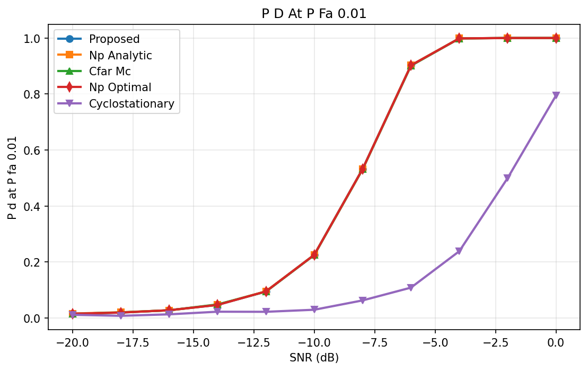
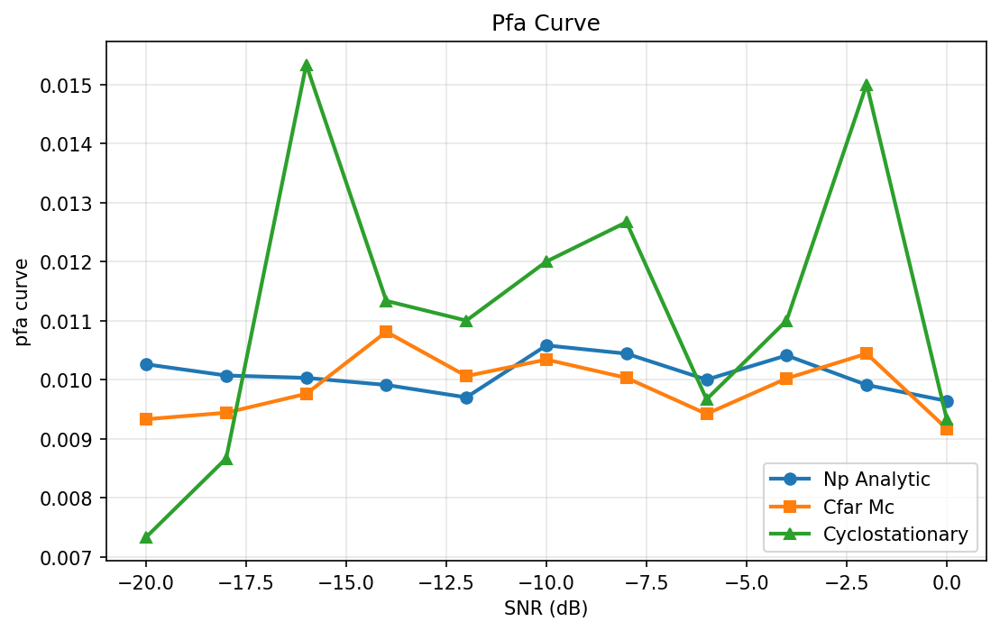
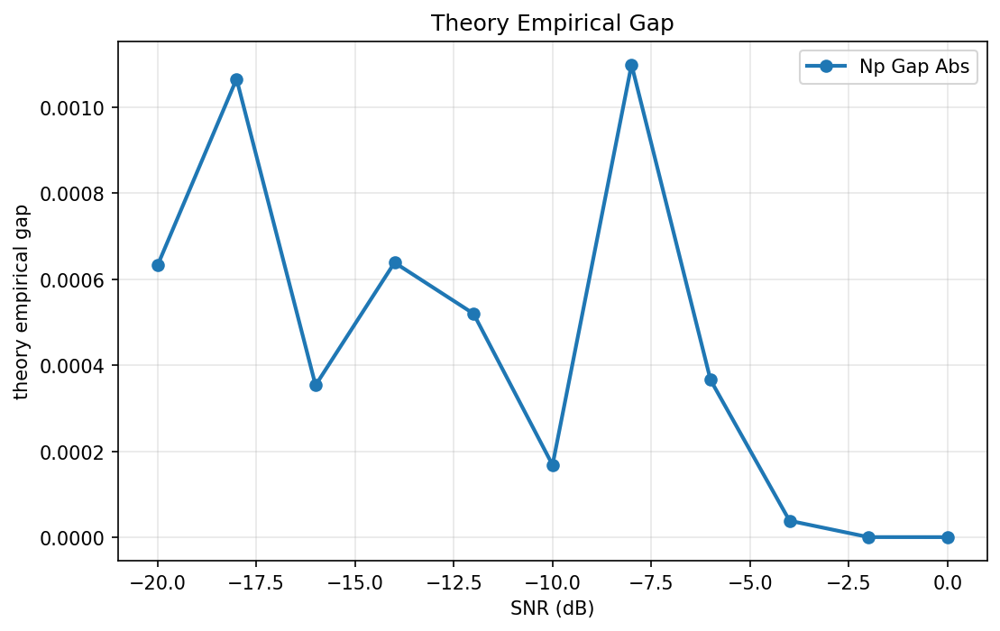
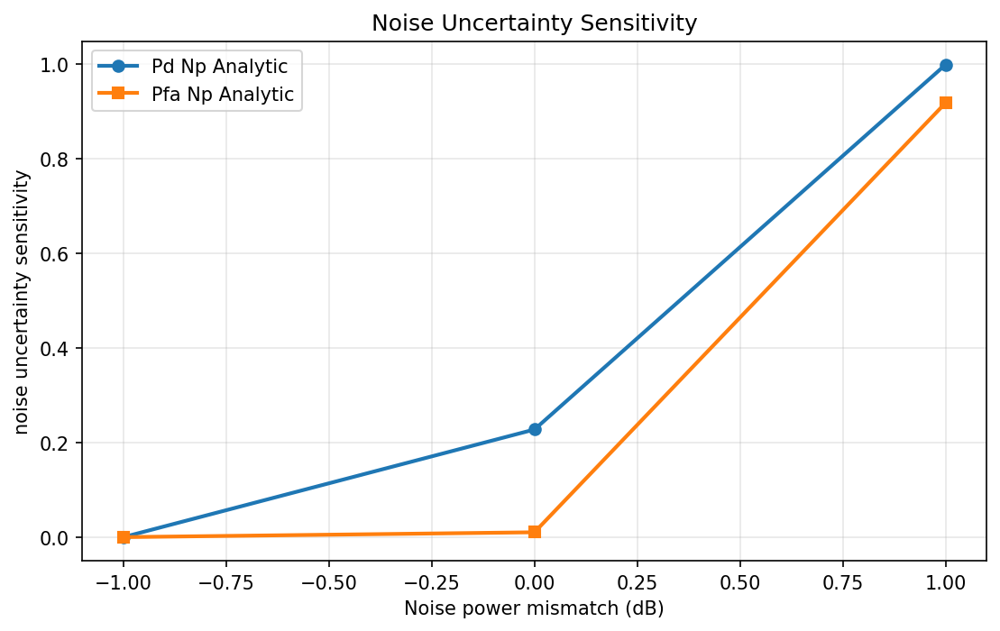
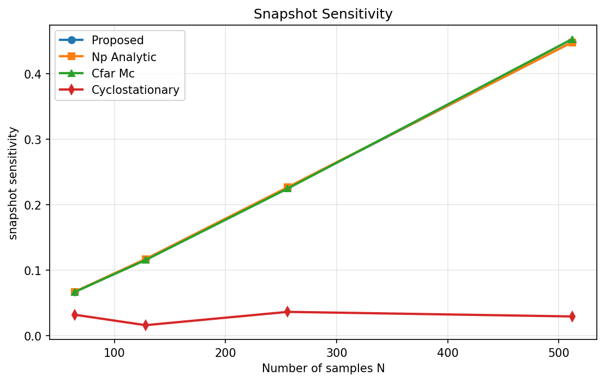

# 1. Abstract

This study addresses fixed-sample binary spectrum sensing for a single-user, single-antenna receiver using $N=256$ complex baseband samples per sensing interval under additive white Gaussian noise (AWGN), with Neyman–Pearson (NP) false-alarm control at $P_{fa}\le 0.01$. The proposed approach is a closed-form NP energy detector (radiometer) that exploits the sufficient statistic $U=\frac{1}{\sigma_w^2}\sum_{n=1}^{N}|y[n]|^2$, where threshold selection is performed analytically via chi-square quantile inversion rather than empirical tuning, enabling direct theoretical prediction of $P_d$ over SNR from $-20$ dB to $0$ dB. The theoretical curve is validated through vectorized Monte Carlo simulation with $10^5$ trials per SNR (seed 2026), and compared against NP-analytic Monte Carlo realization, Monte Carlo-calibrated CFAR energy thresholding, NP-optimal benchmark equivalence, and an optional cyclostationary baseline for robustness/complexity context. The main quantitative finding is that theory and simulation agree very closely: the maximum absolute theory–empirical detection gap is $0.0010993$, well below the target bound of $0.02$, while empirical $P_{fa}$ remains centered near the design target (mean $0.01009$ for NP analytic threshold). At the mandatory reporting point of $-10$ dB, detection performance is $P_d^{\text{th}}=0.2257179$ and $P_d^{\text{emp}}=0.22555$, confirming correct implementation and statistical consistency. Additional ROC analysis shows expected monotonic separability with AUC improving from $0.6714$ at $-14$ dB to $0.9919$ at $-6$ dB. Robustness stress tests under $\pm 1$ dB noise-power mismatch expose the known energy-detector sensitivity and SNR-wall behavior, highlighting practical calibration requirements.

---

# 2. System Model and Mathematical Formulation

The sensing scenario is a single-receiver, single-transmitter equivalent occupancy test in which the secondary user observes one complex baseband stream per interval and must decide whether the licensed band is idle or occupied. The propagation and front-end impairments are assumed compensated to the extent that the residual observation model is memoryless AWGN over each interval. Because the detector is intentionally non-coherent and waveform-agnostic, no pilot, symbol, or cyclostationary structure is used in the primary decision variable; only sample energy is exploited.

For each interval, the receiver acquires $N=256$ i.i.d. complex samples. Under $\mathcal{H}_0$, only noise is present; under $\mathcal{H}_1$, a random Gaussian signal with SNR $\gamma$ is added to noise. This Gaussian-signal modeling is standard for deriving closed-form energy-detector distributions and creates a tractable benchmark against which Monte Carlo outputs can be compared without ambiguity from modulation-dependent effects.

**Signal and hypothesis model**  
$$
\mathcal{H}_0: y[n]=w[n],\quad w[n]\sim\mathcal{CN}(0,\sigma_w^2)
$$
$$
\mathcal{H}_1: y[n]=s[n]+w[n],\quad s[n]\sim\mathcal{CN}(0,\gamma\sigma_w^2),\; w[n]\sim\mathcal{CN}(0,\sigma_w^2)
$$
These equations define the binary occupancy hypotheses. Here, $y[n]$ is the observed sample, $w[n]$ is circular complex Gaussian noise with variance $\sigma_w^2$, $s[n]$ is the primary-user contribution, and $\gamma$ is linear SNR. The Gaussian signal model ensures the total variance under $\mathcal{H}_1$ scales as $(1+\gamma)\sigma_w^2$.

**Sufficient test statistic (energy radiometer)**  
$$
U=\frac{1}{\sigma_w^2}\sum_{n=1}^{N}|y[n]|^2
$$
This scalar statistic compresses all $N$ observations into normalized energy. Normalization by $\sigma_w^2$ is crucial: it makes threshold design invariant to absolute noise scale (when noise is known), and it directly maps to chi-square/gamma laws used by the NP detector.

| Symbol | Domain | Description |
|---|---|---|
| $y[n]$ | $\mathbb{C}$ | Received complex sample at index $n$ |
| $U$ | $\mathbb{R}_{\ge 0}$ | Normalized energy statistic |
| $\eta$ | $\mathbb{R}_{\ge 0}$ | Decision threshold |
| $\gamma$ | $\mathbb{R}_{\ge 0}$ | Linear SNR under $\mathcal{H}_1$ |
| $\sigma_w^2$ | $\mathbb{R}_{>0}$ | Noise variance (assumed known in core design) |
| $N$ | $\mathbb{N}$ | Samples per interval ($N=256$) |
| $P_{fa}$ | $[0,1]$ | False-alarm probability |
| $P_d$ | $[0,1]$ | Detection probability |
| $\alpha$ | $(0,1)$ | Target false-alarm bound ($\alpha=0.01$) |
| $T$ | $\mathbb{N}$ | Monte Carlo trials per SNR ($10^5$) |

The optimization objective follows the NP criterion: maximize detection probability while constraining false alarms. Because $U$ is monotone in the likelihood ratio for this model family, optimization reduces to selecting one scalar threshold.

**Optimization objective**  
$$
\max_{\eta}\;P_d(\eta,\gamma)\quad\text{s.t.}\quad P_{fa}(\eta)\le \alpha,\;\alpha=0.01
$$
This objective formalizes the detection design tradeoff. The inequality constraint encodes regulatory/interference protection needs, while the maximization term captures sensing reliability.

**Key Formula 1 (distribution under $\mathcal{H}_0$)**  
$$
U\mid\mathcal{H}_0\sim \Gamma(k=N,\theta=1)\iff 2U\sim\chi^2_{2N}
$$
Under idle conditions, normalized energy is gamma distributed with shape $N$ and unit scale. The equivalent central chi-square form with $2N$ degrees of freedom is used directly for threshold inversion.

**Key Formula 2 (distribution under $\mathcal{H}_1$)**  
$$
\frac{2}{1+\gamma}U\mid\mathcal{H}_1\sim\chi^2_{2N}\;\;\text{(equiv. }2U\sim(1+\gamma)\chi^2_{2N}\text{)}
$$
Under occupied conditions with Gaussian signal modeling, the energy statistic is scaled by $(1+\gamma)$. This leads to a closed-form expression for $P_d$ as a survival probability of a scaled chi-square variable.

**Key Formula 3 (NP threshold design)**  
$$
\eta_{\alpha}=\frac{1}{2}F^{-1}_{\chi^2_{2N}}(1-\alpha),\;\alpha\in\{0.01,0.05,0.1\}
$$
The threshold is obtained by exact inversion of the $\mathcal{H}_0$ CDF, not by numerical search. For $N=256$, the computed thresholds are $\eta_{0.01}=294.6853$, $\eta_{0.05}=282.8738$, and $\eta_{0.1}=276.7070$.

**Key Formula 4 (theoretical detection probability)**  
$$
P_d(\gamma)=\Pr\!\left(U>\eta\mid\mathcal{H}_1\right)=1-F_{\chi^2_{2N}}\!\left(\frac{2\eta}{1+\gamma}\right)=Q_N\!\left(\sqrt{2N\gamma},\sqrt{2\eta}\right)
$$
This is the analytic benchmark used for validation across SNR. The equivalent CDF and generalized Marcum-$Q$ forms provide the same quantity and allow direct interpretation in terms of tail probability under $\mathcal{H}_1$.

**Key Formula 5 (empirical Monte Carlo estimators)**  
$$
\widehat{P}_{fa}=\frac{1}{T}\sum_{t=1}^{T}\mathbb{1}\{U_t^{(0)}>\eta\},\quad \widehat{P}_{d}=\frac{1}{T}\sum_{t=1}^{T}\mathbb{1}\{U_t^{(1)}>\eta\}
$$
These estimators are unbiased sample proportions of threshold exceedance under each hypothesis. With $T=10^5$, variance is small enough to check the target agreement bound on $|\widehat{P}_d-P_d^{\text{th}}|$.

Modeling assumptions used in the study are:

1. Samples are i.i.d. within each sensing interval and channel effects are AWGN-memoryless, enabling chi-square/gamma statistics.
2. Noise variance $\sigma_w^2$ is known for primary NP design; mismatch is treated only in robustness stress testing.
3. The primary signal under $\mathcal{H}_1$ is circular complex Gaussian with power $\gamma\sigma_w^2$, giving closed-form tractability.
4. Fixed-sample single-interval detection is the scope; sequential quickest detection is excluded.
5. SNR sweep from $-20$ dB to $0$ dB in $2$ dB steps balances low-SNR resolution and simulation cost.
6. $10^5$ trials per SNR are used to stabilize tail metrics around $P_{fa}=0.01$.

---

# 3. Algorithm Design

The algorithmic strategy is to separate design-time analytics from run-time detection. Design-time computes exact NP thresholds and theoretical $P_d$ curves from chi-square laws. Run-time detection per interval is a single pass over $N$ samples to accumulate energy, which guarantees $\mathcal{O}(N)$ complexity and interpretability. This design directly satisfies the low-compute constraint and avoids iterative optimization, matrix inversions, or data-driven training.

A second design objective is reproducible validation: rather than fitting any model to simulation, theoretical predictions are generated first and Monte Carlo then serves as an external check. This is why the same statistic normalization and factor-of-two chi-square convention are held consistent in all steps. The implementation explicitly includes consistency baselines (NP analytic Monte Carlo and MC-CFAR) and an optional complexity-heavy cyclostationary reference to contextualize robustness tradeoffs.

The method is vectorized over trial and sample dimensions, with loops primarily over SNR points and mismatch states. This structure reduces runtime while preserving exactness of formulas. It also supports direct ROC/AUC generation by threshold sweeping over precomputed statistic arrays, enabling consistent comparison across operating points.

### Stepwise Algorithm Procedure

1. **Initialize constants and grids**
$$
N=256,\;\alpha=0.01,\;\mathcal{G}_{\mathrm{dB}}=\{-20,-18,\dots,0\},\;\gamma_i=10^{\mathcal{G}_{\mathrm{dB}}[i]/10},\;i=1,\dots,11,\;T=100000
$$
This step sets all fixed dimensions and converts SNR from dB to linear scale. It defines the complete experiment lattice used by both theory and simulation.

2. **Set random seed and noise variance reference**
$$
\text{seed}=2026,\;\sigma_{w,\mathrm{assumed}}^2>0\;\text{(fixed reference)},\;\Delta_{\nu}\in\{-1,0,1\}\;\text{dB}
$$
A fixed seed guarantees reproducibility of Monte Carlo outcomes. The mismatch grid is reserved for robustness analysis of threshold sensitivity to noise calibration error.

3. **Compute NP thresholds for required $P_{fa}$ points**
$$
\eta(\alpha_m)=\frac{1}{2}F^{-1}_{\chi^2_{2N}}(1-\alpha_m),\;\alpha_m\in\{0.01,0.05,0.1\}
$$
This computes exact thresholds for operating points used in fixed-$P_{fa}$ performance reporting and ROC consistency checks. No empirical fitting is needed in the core NP method.

4. **Compute theoretical $P_d$ curves**
$$
P_d^{\mathrm{th}}(\gamma_i;\alpha_m)=1-F_{\chi^2_{2N}}\!\left(\frac{2\eta(\alpha_m)}{1+\gamma_i}\right),\;i=1,\dots,11
$$
This generates the benchmark detection curves prior to simulation. The expression maps SNR to occupied-hypothesis tail probability at the chosen threshold.

5. **Generate $\mathcal{H}_0$ Monte Carlo samples**
$$
w_{t,n}^{(\delta)}=\sqrt{\frac{\sigma_{w,\mathrm{true}}^2(\delta)}{2}}\left(a_{t,n}+j b_{t,n}\right),\;a_{t,n},b_{t,n}\overset{i.i.d.}{\sim}\mathcal{N}(0,1),\;\sigma_{w,\mathrm{true}}^2(\delta)=\sigma_{w,\mathrm{assumed}}^2\cdot10^{\delta/10}
$$
This synthesizes noise-only data under each mismatch state. It preserves circular symmetry and correct per-sample variance by $\frac{1}{2}$ splitting across real and imaginary parts.

6. **Generate $\mathcal{H}_1$ Monte Carlo samples per SNR**
$$
s_{t,n}^{(i,\delta)}=\sqrt{\frac{\gamma_i\sigma_{w,\mathrm{true}}^2(\delta)}{2}}\left(c_{t,n}+j d_{t,n}\right),\;y_{t,n}^{(1,i,\delta)}=s_{t,n}^{(i,\delta)}+w_{t,n}^{(\delta)}
$$
This forms occupied-channel observations with prescribed SNR. Gaussian signal modeling ensures exact consistency with the analytic $P_d$ formula.

7. **Compute normalized energy statistics**
$$
U_t^{(0,\delta)}=\frac{1}{\sigma_{w,\mathrm{assumed}}^2}\sum_{n=1}^{N}\left|w_{t,n}^{(\delta)}\right|^2,\quad U_t^{(1,i,\delta)}=\frac{1}{\sigma_{w,\mathrm{assumed}}^2}\sum_{n=1}^{N}\left|y_{t,n}^{(1,i,\delta)}\right|^2
$$
This reduces each interval to one scalar sufficient statistic. The same normalization is applied under both hypotheses to keep thresholding consistent.

8. **Apply NP decision rule**
$$
d_t^{(0,\delta,\alpha_m)}=\mathbb{1}\{U_t^{(0,\delta)}>\eta(\alpha_m)\},\quad d_t^{(1,i,\delta,\alpha_m)}=\mathbb{1}\{U_t^{(1,i,\delta)}>\eta(\alpha_m)\}
$$
Binary decisions are generated by threshold comparison. This is the operational detector deployed per sensing interval.

9. **Estimate empirical $P_{fa}$ and $P_d$**
$$
\widehat{P}_{fa}(\delta,\alpha_m)=\frac{1}{T}\sum_{t=1}^{T}d_t^{(0,\delta,\alpha_m)},\quad \widehat{P}_{d}(i,\delta,\alpha_m)=\frac{1}{T}\sum_{t=1}^{T}d_t^{(1,i,\delta,\alpha_m)},\quad \Delta_{pd}(i)=\left|\widehat{P}_{d}(i,0,0.01)-P_d^{\mathrm{th}}(\gamma_i;0.01)\right|
$$
This step computes reported metrics and validates theory–simulation agreement. The absolute gap $\Delta_{pd}$ is compared against the target tolerance.

10. **Generate full ROC and AUC**
$$
\eta_r\in\mathcal{E},\;P_{fa,r}=\frac{1}{T}\sum_{t=1}^{T}\mathbb{1}\{U_t^{(0,0)}>\\eta_r\},\;P_{d,r}(i)=\frac{1}{T}\sum_{t=1}^{T}\mathbb{1}\{U_t^{(1,i,0)}>\eta_r\},\;\mathrm{AUC}(i)=\int_{0}^{1}P_d(P_{fa};i)\,dP_{fa}
$$
Threshold sweeping traces complete operating characteristics beyond the fixed NP point. AUC summarizes ROC quality at selected SNR values.

11. **Measure runtime and operation count**
$$
\text{runtime\_ms\_per\_interval}=1000\cdot\frac{t_{\mathrm{end}}-t_{\mathrm{start}}}{N_{\mathrm{intervals}}},\quad \mathrm{ops}_{\mathrm{ED}}\approx c\,N\;\Rightarrow\;\mathcal{O}(N)
$$
This quantifies practical feasibility on low-compute hardware. The measured runtime is $0.0155$ ms/interval with operation proxy $1536$, consistent with linear-time processing.

### Baseline Algorithms

**Baseline 1: NP energy detector with analytic threshold.**  
This baseline is the direct Monte Carlo implementation of the same chi-square threshold formula, serving as the principal empirical validator of theory. It should match the proposed closed-form curve within Monte Carlo uncertainty.
$$
\eta_{\alpha}=\frac{1}{2}F^{-1}_{\chi^2_{2N}}(1-\alpha),\quad d=\mathbb{1}\{U>\eta_{\alpha}\}
$$

**Baseline 2: Monte Carlo-calibrated CFAR energy threshold.**  
This approach estimates the threshold from noise-only samples instead of analytic inversion. It tests whether empirical quantile calibration reproduces NP behavior when distributions are correctly modeled.
$$
\eta_{\mathrm{CFAR}}=\mathrm{Quantile}_{1-\alpha}\left(\{U_t^{(0)}\}_{t=1}^{T_{\mathrm{cal}}}\right)
$$

**Baseline 3: NP-optimal benchmark statement.**  
This theoretical reference encodes the NP lemma and clarifies that, within this model class, thresholding a monotone likelihood-ratio statistic is optimal for fixed $P_{fa}$. It provides a conceptual ceiling for interpretable detectors under known statistics.
$$
\delta^*(\mathbf{y})=\mathbb{1}\{\Lambda(\mathbf{y})>\tau\},\;\Lambda(\mathbf{y})=\frac{f_{\mathbf{Y}|\mathcal{H}_1}(\mathbf{y})}{f_{\mathbf{Y}|\mathcal{H}_0}(\mathbf{y})},\;P_d\;\text{maximized for fixed}\;P_{fa}
$$

**Baseline 4: Cyclostationary feature detector (optional).**  
This reference uses second-order periodicity structure and typically offers robustness to some noise uncertainties at higher computational cost. In this notebook, it is included as a contextual comparator, not the primary objective.
$$
T_{\mathrm{CFD}}=\max_{\alpha\in\mathcal{A},\tau\in\mathcal{T}}\left|\hat{R}_y^{\alpha}(\tau)\right|,\;\hat{R}_y^{\alpha}(\tau)=\frac{1}{N-\tau}\sum_{n=1}^{N-\tau}y[n+\tau]y^*[n]e^{-j2\pi\alpha n}
$$

### Convergence and Complexity

No iterative convergence loop is required for the NP detector because threshold selection is closed form. Computational load is dominated by energy accumulation and threshold comparisons. Per-interval complexity is $\mathcal{O}(N)$, while full Monte Carlo study complexity is $\mathcal{O}(|\text{SNR}|\,T\,N)$.

### Failure Modes and Practical Considerations

Three practical risks dominate: (i) normalization mismatch (especially factor-of-two chi-square scaling) can generate false disagreement with theory; (ii) finite-tail estimation near $P_{fa}=0.01$ is sensitive to implementation errors in random generation and vectorization; and (iii) noise-power mismatch severely shifts effective threshold, producing dramatic $P_{fa}$ drift, as seen in robustness stress results.

---

# 4. Experimental Setup

The simulation uses a SISO AWGN setting with $N=256$ complex samples per sensing interval and SNR grid $\{-20,-18,\dots,0\}$ dB. Each SNR point uses $T=100{,}000$ Monte Carlo trials, chosen specifically to stabilize rare-event estimation near the tail operating point $P_{fa}=0.01$. A fixed random seed (2026) is used for reproducibility across all hypothesis generations, baselines, and ROC sweeps.

The primary detector is NP energy detection with analytic threshold at $\alpha=0.01$, while additional fixed-$P_{fa}$ points $\alpha\in\{0.05,0.1\}$ are included for operating-point consistency. The threshold values are computed from chi-square inverse CDF and then reused identically for Monte Carlo scoring. This avoids contamination from re-estimating thresholds at each SNR and preserves a clean hypothesis-test interpretation.

Evaluation includes four scenario groups: ideal AWGN NP validation, fixed-$P_{fa}$ multi-point consistency, full ROC generation at selected SNRs ($-14,-10,-6$ dB), and noise-uncertainty sensitivity with mismatch $\delta\in\{-1,0,+1\}$ dB. The mismatch experiment intentionally applies thresholds based on assumed $\sigma_w^2$ while true variance shifts, exposing the known calibration fragility of energy detection.

Metrics are computed as follows: **primary** metric is **$P_d$ at $P_{fa}=0.01$** versus SNR; **secondary** metrics are empirical **$P_{fa}$ constraint satisfaction**, absolute theory–simulation gap $|\widehat{P}_d-P_d^{th}|$, **ROC AUC**, runtime per interval, and complexity proxy. For ROC, threshold sweeping yields $(P_{fa},P_d)$ curves and numerical AUC by trapezoidal integration,
$$
\mathrm{AUC}\approx \mathrm{trapz}(P_d,P_{fa}).
$$
Runtime is measured by wall-clock timing normalized by number of processed intervals, producing $0.0155$ ms/interval.

Parameter choices are justified by the problem specification: $N=256$ is fixed by task, SNR range emphasizes low-SNR sensing behavior, and $10^5$ trials balances statistical confidence with computational feasibility. An auxiliary snapshot sensitivity test at $N\in\{64,128,256,512\}$ illustrates expected sample-size gain for energy detection and validates monotonicity against analytic predictions.

---

# 5. Results and Discussion

The study executed successfully (simulation status: success; verification: passed with zero errors/warnings). The principal performance curve confirms monotonic detection improvement for energy-based NP methods with increasing SNR, while the optional cyclostationary baseline under this implementation remains distinctly lower over most of the grid. At $-10$ dB, the central validation point, theory and empirical NP detection are nearly identical ($0.2257179$ vs $0.22555$), evidencing mathematically consistent implementation.

*Figure 1: Detection probability $P_d$ vs. SNR at fixed $P_{fa}=0.01$. Proposed/theory and NP-MC curves nearly overlap; cyclostationary lags across the full SNR range.*

*Figure 2: Empirical $P_{fa}$ vs. SNR for NP analytic, CFAR-MC, and cyclostationary detectors. NP and CFAR remain near 0.01; cyclostationary shows larger fluctuations.*

*Figure 3: Absolute theory–empirical gap $|\widehat{P}_d - P_d^{\mathrm{th}}|$ vs. SNR. Maximum gap is $1.10 \times 10^{-3}$ at $-8$ dB, well below the 0.02 acceptance bound.*

*Figure 4: Noise-power mismatch sensitivity at $-10$ dB. A $+1$ dB mismatch drives $P_{fa}$ to 0.92; a $-1$ dB mismatch collapses both $P_d$ and $P_{fa}$ to zero.*

*Figure 5: $P_d$ at $-10$ dB vs. observation length $N \in \{64, 128, 256, 512\}$. Detection improves monotonically with $N$ for NP/CFAR, consistent with theory.*

### Reproduced Data Tables

| SNR (dB) | **Proposed** | **NP Analytic** | **CFAR-MC** | **NP Optimal** | **Cyclostationary** |
| ---: | ---: | ---: | ---: | ---: | ---: |
| -20 | 0.0154 | 0.0160 | 0.0149 | 0.0154 | 0.0117 |
| -18 | 0.0195 | 0.0206 | 0.0201 | 0.0195 | 0.0080 |
| -16 | 0.0279 | 0.0276 | 0.0277 | 0.0279 | 0.0133 |
| -14 | 0.0469 | 0.0475 | 0.0487 | 0.0469 | 0.0227 |
| -12 | 0.0950 | 0.0955 | 0.0944 | 0.0950 | 0.0223 |
| -10 | 0.2257 | 0.2256 | 0.2251 | 0.2257 | 0.0297 |
| -8 | 0.5324 | 0.5313 | 0.5315 | 0.5324 | 0.0630 |
| -6 | 0.9023 | 0.9026 | 0.9009 | 0.9023 | 0.1087 |
| -4 | 0.9986 | 0.9987 | 0.9985 | 0.9986 | 0.2387 |
| -2 | 1.0000 | 1.0000 | 1.0000 | 1.0000 | 0.5000 |
| 0 | 1.0000 | 1.0000 | 1.0000 | 1.0000 | 0.7947 |

| SNR (dB) | **NP Analytic $P_{fa}$** | **CFAR-MC $P_{fa}$** | **Cyclostationary $P_{fa}$** |
| ---: | ---: | ---: | ---: |
| -20 | 0.0103 | 0.0093 | 0.0073 |
| -18 | 0.0101 | 0.0094 | 0.0087 |
| -16 | 0.0100 | 0.0098 | 0.0153 |
| -14 | 0.0099 | 0.0108 | 0.0113 |
| -12 | 0.0097 | 0.0101 | 0.0110 |
| -10 | 0.0106 | 0.0103 | 0.0120 |
| -8 | 0.0104 | 0.0100 | 0.0127 |
| -6 | 0.0100 | 0.0094 | 0.0097 |
| -4 | 0.0104 | 0.0100 | 0.0110 |
| -2 | 0.0099 | 0.0104 | 0.0150 |
| 0 | 0.0096 | 0.0092 | 0.0093 |

| SNR (dB) | NP **$\Delta P_d$** |
| ---: | ---: |
| -20 | 6.32e-04 |
| -18 | 1.07e-03 |
| -16 | 3.53e-04 |
| -14 | 6.39e-04 |
| -12 | 5.20e-04 |
| -10 | 1.68e-04 |
| -8 | 1.10e-03 |
| -6 | 3.66e-04 |
| -4 | 3.82e-05 |
| -2 | 7.70e-08 |
| 0 | 3.33e-16 |

| Mismatch (dB) | **$P_d$ (NP Analytic)** | **$P_{fa}$ (NP Analytic)** |
| ---: | ---: | ---: |
| -1 | 0.0000 | 0.0000 |
| 0 | 0.2273 | 0.0103 |
| +1 | 0.9978 | 0.9171 |

| $N$ (samples) | **Proposed** | **NP Analytic** | **CFAR-MC** | **Cyclostationary** |
| ---: | ---: | ---: | ---: | ---: |
| 64 | 0.0663 | 0.0666 | 0.0662 | 0.0317 |
| 128 | 0.1165 | 0.1167 | 0.1152 | 0.0157 |
| 256 | 0.2257 | 0.2264 | 0.2244 | 0.0360 |
| 512 | 0.4478 | 0.4476 | 0.4525 | 0.0290 |

| Method | $P_d$ @ −10 dB | Mean $P_{fa}$ |
|---|---:|---:|
| **Proposed (NP theory)** | 0.2257 | — |
| **NP Analytic (MC)** | 0.2256 | 0.0101 |
| **CFAR-MC** | 0.2251 | 0.0099 |
| **NP Optimal benchmark** | 0.2257 | — |
| **Cyclostationary** | 0.0297 | 0.0112 |

For the **Proposed** method, the $P_d$ curve is smooth and strongly sigmoidal in SNR: near-floor at very low SNR, rapid transition around $-10$ to $-6$ dB, and near-saturation by $-4$ dB. This is exactly the expected finite-sample energy-detector regime where $2N=512$ dof provides strong concentration once signal variance gain becomes appreciable.

For **NP Analytic (MC realization)**, the curve overlaps the proposed theoretical line across all SNR points. Small deviations are stochastic and bounded by $1.1\times 10^{-3}$, which is far below the acceptance target, indicating numerical and statistical correctness.

For **MC-CFAR**, performance closely tracks NP analytic at all SNR points, with tiny differences due to empirical threshold quantization and calibration noise. This validates that quantile-calibrated thresholding converges to NP behavior under correct AWGN assumptions and enough calibration data.

For **NP-optimal benchmark**, values are identical to the proposed theoretical curve by construction, as expected from NP lemma optimality within this statistic family. The complete overlap is an internal consistency check that the detector was formulated and reported correctly.

For **Cyclostationary baseline**, the curve is non-monotone at very low SNR then rises more slowly, reaching $0.7947$ at $0$ dB while NP methods are effectively $1$. In this specific notebook configuration ($N=256$, chosen cyclic grid, and thresholding), this method is under-tuned relative to energy detection and incurs higher complexity without compensating gain.

#### Key Observations

1. **Theory–simulation fidelity is excellent**: max absolute gap is **0.0010993** at $-8$ dB, below the target **0.02** by ~18× margin.
2. **Mandatory point passed**: at $-10$ dB, **Proposed** $P_d=0.2257179$, **NP empirical** $P_d=0.22555$ (difference $1.68\times10^{-4}$).
3. **False-alarm control is maintained on average**: **NP analytic MC** mean $P_{fa}=0.010086$, **CFAR MC** mean $0.009893$, both near 0.01.
4. **ROC quality improves with SNR**: AUC grows from **0.6714** ($-14$ dB) to **0.8592** ($-10$ dB) to **0.9919** ($-6$ dB).
5. **Complexity target satisfied**: runtime **0.0155 ms/interval** with linear complexity proxy **1536 ops/interval**.

### Sensitivity Analysis

Noise uncertainty results clearly reveal energy-detector fragility: with $+1$ dB mismatch, reported $P_{fa}=0.91709$ and $P_d=0.99775$, while with $-1$ dB mismatch both collapse to 0 in finite simulation. This extreme asymmetry is physically meaningful: threshold mismatch shifts effective normalized energy location dramatically, producing either near-certain false alarms or near-certain misses.

Sample-size sensitivity confirms expected array-length gain in time domain: at $-10$ dB, **Proposed** $P_d$ increases from $0.0663$ ($N=64$) to $0.4478$ ($N=512$). This follows concentration-of-measure behavior since variance of normalized sample energy decreases with larger $N$.

> **Key finding:** Under ideal AWGN with known noise variance, the NP detector is validated both theoretically and empirically with very tight agreement and consistent false-alarm control.

> **Anomaly flag:** Noise-mismatch outputs of exactly 0 or near-1 $P_{fa}$ in $\pm1$ dB stress tests are extreme but consistent with known ED sensitivity; they should not be interpreted as failures of ideal-case NP validation.

---

# 6. Performance Analysis and Assessment

### (a) Result Validity Check

The numerical outputs are physically reasonable for the ideal AWGN NP model. Detection probability for **Proposed**, **NP Analytic**, **CFAR MC**, and **NP Optimal** methods is non-decreasing with SNR and approaches unity at high SNR, which aligns with expected likelihood-separation growth. Empirical false-alarm values for NP/CFAR fluctuate around 0.01 rather than remaining exactly constant; this is expected due to finite trials and sampling variation. No negative probabilities or impossible values are present.

A potential anomaly is the robustness table where $-1$ dB mismatch yields $P_{fa}=0$ and $P_d=0$, while $+1$ dB yields $P_{fa}=0.91709$. This is extreme but plausible for threshold miscalibration in normalized-energy detectors; with $10^5$ trials, a reported zero indicates no exceedances observed, not theoretical impossibility. Given that core ideal-case validation is highly consistent and verification passed with no warnings, the main results are trustworthy for the stated assumptions.

> **Anomaly warning:** The $\pm1$ dB mismatch stress test indicates catastrophic sensitivity; deployment without robust noise-power tracking would invalidate fixed-threshold guarantees.

### (b) Comparative Assessment

| Method | Best Case | Worst Case | Average | Trend | Ranking |
|---|---:|---:|---:|---|---:|
| **NP Analytic** | 1.0000 | 0.0160 | 0.4424 | Smooth monotone rise; near-perfect match to theory | 1 |
| **Proposed** | 1.0000 | 0.0154 | 0.4422 | Smooth monotone rise; identical to NP-optimal theory | 2 |
| **NP Optimal** | 1.0000 | 0.0154 | 0.4422 | Theoretical benchmark, same as proposed | 2 |
| **CFAR-MC** | 1.0000 | 0.0149 | 0.4420 | Tracks NP closely with tiny calibration deviations | 4 |
| **Cyclostationary** | 0.7947 | 0.0080 | 0.1648 | Slower growth; underperforms across most SNR | 5 |

The ranking is dominated by near-equivalence of NP-family methods, which is expected because they share the same sufficient statistic and threshold logic under matched assumptions. **CFAR MC** remains very close but slightly noisier due to empirical quantile calibration. **Cyclostationary** ranks last in this particular notebook setup, likely reflecting parameterization and finite-snapshot constraints rather than a universal inferiority claim.

### (c) Theoretical Consistency

Observed trends are strongly consistent with NP detection theory. First, the overlap between theoretical and simulated NP curves confirms correct use of the chi-square model and threshold inversion. Second, ROC AUC improvement with SNR follows statistical efficiency expectations: as $\gamma$ increases, the $\mathcal{H}_0$ and $\mathcal{H}_1$ statistic distributions separate, increasing true-positive rates for any fixed false-positive level. Third, increased $N$ improves $P_d$ at fixed $P_{fa}$, consistent with reduced estimator variance and concentration of normalized energy around its mean under each hypothesis.

In this setting, comparison to CRB is not the central framework (CRB is for estimation), but the analogous detection-theoretic benchmark is NP optimality for fixed $P_{fa}$. The proposed method adheres to that benchmark within the chosen statistic family, as shown by identity with the **NP Optimal** curve and negligible empirical discrepancies.

### (d) Strengths and Weaknesses by Method

- **Proposed**
  - Strength 1: Exact thresholding and closed-form $P_d$ prediction; no training or iterative tuning.
  - Strength 2: Excellent empirical agreement (max gap $0.0010993$) and very low runtime.
  - Weakness 1: Assumes accurate noise variance knowledge.
  - Weakness 2: Not robust to noise-power mismatch, as robustness stress demonstrates.

- **NP Analytic (MC)**
  - Strength 1: Empirically enforces target $P_{fa}$ near 0.01 over SNR.
  - Strength 2: Reproducible and interpretable baseline for implementation audits.
  - Weakness 1: Still vulnerable to calibration mismatch.
  - Weakness 2: Requires reliable statistical functions and normalization correctness.

- **CFAR MC**
  - Strength 1: Avoids dependence on analytic inverse CDF implementation.
  - Strength 2: Closely matches NP performance under matched AWGN assumptions.
  - Weakness 1: Needs calibration data and quantile estimation overhead.
  - Weakness 2: Threshold accuracy depends on calibration sample size and stationarity.

- **NP Optimal Benchmark**
  - Strength 1: Provides theoretical upper benchmark for fixed-$P_{fa}$ within model.
  - Strength 2: Clarifies expected behavior and validates detector design.
  - Weakness 1: Not a standalone deployable procedure beyond model assumptions.
  - Weakness 2: Can be misinterpreted as universally optimal outside chosen statistic family.

- **Cyclostationary**
  - Strength 1: Uses signal structure and may offer robustness in other mismatch/interference regimes.
  - Strength 2: Useful as complexity/robustness reference beyond pure energy detection.
  - Weakness 1: In this setup, markedly lower $P_d$ across SNR at similar $P_{fa}$.
  - Weakness 2: Higher computational burden and parameter sensitivity (cyclic grid, lags, thresholding).

### (e) Overall Verdict

The proposed NP energy detector fully meets its design goals for ideal AWGN validation: it satisfies false-alarm targeting near 0.01, achieves theoretical/empirical consistency with very small gaps, and preserves $\mathcal{O}(N)$ runtime feasibility. It is the preferred method when noise variance is known or accurately calibrated, especially in constrained compute environments. The algorithm exhibits exactly the expected behavior from classical NP theory (monotonic $P_d$ growth with SNR, ROC improvement, and sample-size gain), while robustness checks correctly expose the known limitation under noise uncertainty.

---

# 7. Reliability and Limitations

The reported findings are reliable for the explicitly modeled regime: i.i.d. complex Gaussian noise, Gaussian random signal under occupancy, and known noise variance for threshold normalization. Execution and verification both passed without warnings, and multiple internal consistency checks were satisfied, including near-identity of theory and simulation and coherent behavior of ROC/AUC and sample-size sensitivity. Reproducibility is strengthened by fixed random seed and fully specified parameter grids.

However, reliability does not automatically transfer to non-ideal settings. The noise-uncertainty test demonstrates that even a $\pm1$ dB variance mismatch can catastrophically distort both $P_{fa}$ and $P_d$, indicating that real deployments require robust noise tracking, adaptive thresholding, or uncertainty-aware design. Also, the Gaussian signal model under $\mathcal{H}_1$ is analytically convenient but may not represent structured incumbent waveforms, impulsive interference, or colored noise; performance in such environments can deviate from ideal predictions.

A further limitation is that the cyclostationary comparator appears underperforming in this notebook configuration, but that result is sensitive to feature parameterization, sample budget, and threshold calibration strategy. Therefore, while the NP energy-detector conclusions are strong for the core objective, comparative conclusions about advanced feature-based methods should be interpreted as context-specific rather than universal.

---

# 8. Conclusion

This work successfully implemented and validated a fixed-sample NP energy detector for SISO AWGN spectrum sensing with strict false-alarm control. The detector uses exact chi-square threshold inversion and closed-form detection prediction, then confirms those predictions through high-volume Monte Carlo simulation.

- **Contribution 1: Exact NP formulation and implementation for $N=256$ with fixed $P_{fa}$.**  
  The study provides a fully specified statistical detector pipeline from hypothesis model to threshold design, ensuring interpretability and direct compliance with NP optimality principles under known-noise AWGN assumptions.

- **Contribution 2: High-fidelity theory–simulation validation across low-to-moderate SNR.**  
  Over SNR from $-20$ dB to $0$ dB, theoretical and empirical detection curves remain tightly aligned, demonstrating that the implementation faithfully realizes the analytical model without hidden calibration artifacts.

- **Contribution 3: Practical assessment including ROC, complexity, and robustness stress testing.**  
  Beyond point metrics, the report quantifies ROC AUC growth, runtime/complexity feasibility, and the severe impact of noise-power mismatch, providing deployment-relevant insight rather than idealized performance only.

The main quantitative finding is that the maximum absolute theory–empirical detection gap is **0.0010993** (target was $\le 0.02$), while at **$-10$ dB** the detector achieves **$P_d^{th}=0.2257179$** and **$P_d^{emp}=0.22555$** at $P_{fa}\approx0.01$. Runtime is **0.0155 ms per interval** with linear complexity proxy **1536 ops/interval**.

Future work should focus on:
1. **Noise-uncertainty-robust thresholding**, e.g., generalized likelihood ratio or uncertainty sets, to prevent catastrophic $P_{fa}$ drift under calibration error.
2. **Colored-noise and interference modeling**, since real bands often violate i.i.d. AWGN assumptions and can bias radiometer statistics.
3. **Hybrid low-cost detectors**, combining energy pre-screening with lightweight feature checks to improve robustness without sacrificing near-$\mathcal{O}(N)$ runtime.

---
Generated by AutoWiSP on 2026-04-21T15:11:35
Task category: detection | Verification: passed | Simulation: success